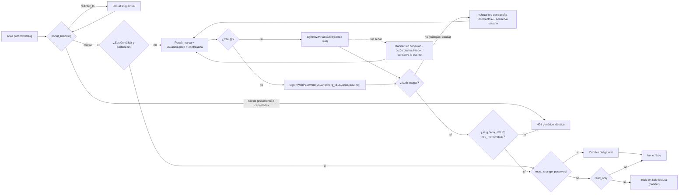
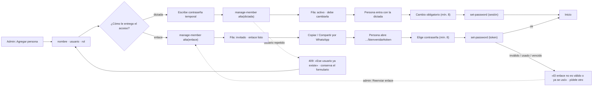
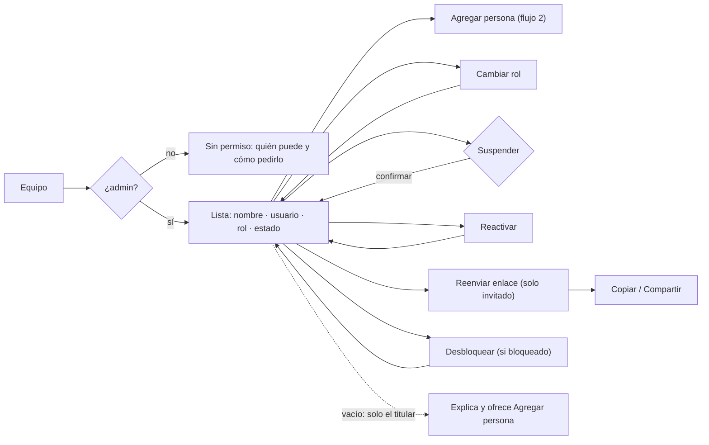

# Brief funcional · Acceso (portal, inicio de sesión, cambio obligatorio, bienvenida, equipo) · r01

**Ruta:** R1 · **Fidelidad:** F2 · **Fecha:** 2026-09-27
**Fuentes leídas:** `docs/PULZ_MAESTRO.md` §7 (portal y acceso), §11.1 (roles), §13.1–§13.3 (navegación, pantallas clave, accesibilidad de campo), §16 Fase 3; esquema real: `supabase/migrations/20260927000002_plataforma.sql` (`organizations`, `organization_members`, `member_invitations`, `login_throttle`), `…0012_portal.sql` (`portal_branding`, `member_login_email`), `…0022_acceso.sql` (vista `mis_membresias`); Edge Functions `supabase/functions/{signup-company,manage-member,set-password}`; Pages Function `apps/web/functions/e/[slug]/[[path]].ts`; perfil `.claude/skills/lima/profiles/pulz.md` (breakpoints 1440/1024/768/390, WCAG 2.2 AA + uso bajo el sol, targets 44 px); `docs/DUDAS.md` #9 (hook de intentos no disponible en el plan); `docs/plan/FASE-3.md`.

> Ruta: R1 · Fidelidad: F2 — porque la pregunta es estructural (qué va primero, qué se ve antes de la sesión, cómo se resuelven los rechazos y los estados vencida/404) y depende de contenido real (nombres largos de empresa, mensaje de 140, lista de miembros con estados). No hay duda de apariencia: el sistema PULZ ya existe y lo aplica coco en F3.

## Enunciado

Una persona de un palenque (el dueño con su correo, o un trabajador con su usuario simple) necesita **entrar al portal de su empresa desde el teléfono, con sol de frente y una mano**, porque sin sesión no puede registrar nada; y el administrador necesita **dar de alta a su gente y entregarles el acceso** (dictándoles una contraseña o mandándoles un enlace por WhatsApp) sin que nadie de otra empresa pueda enterarse de quién existe.

## Pregunta de diseño

¿Puede cualquier persona del palenque entrar en menos de 20 segundos con un solo campo, sin saber qué es un "correo sintético", y puede el administrador dar acceso a alguien nuevo en un solo paso, eligiendo entre dictar o mandar enlace?

- **Verbo principal:** *entrar* (portal); *fijar contraseña* (cambio obligatorio, bienvenida); *dar acceso* (equipo).
- **Resultado verificable:** la app abre en Inicio con el nombre de la empresa arriba y la persona ve su nombre; en equipo, aparece la fila nueva con estado `invitado` (enlace) o `activo` (dictada) y el enlace queda copiado.
- **Dato/acción dominante:** portal → la marca de la empresa + un campo *usuario o correo*; equipo → la lista de personas con su rol y estado, y una sola acción: **Agregar persona**.

## Usuarios y permisos

| Usuario | Necesita | Permiso (fuente) |
|---|---|---|
| Titular (dueño) | Entrar con su correo real; recuperar acceso por correo | `organization_members.role = admin`, `username` nulo (§7.2) |
| Colaborador (productor / operador) | Entrar con usuario simple `ana.lopez` + contraseña; si le dictaron la contraseña, cambiarla la primera vez; si le mandaron enlace, elegirla ahí | `username` único por empresa; `must_change_password`; `member_invitations` (§7.6) |
| Administrador | Ver equipo; alta (dictada / enlace); cambiar rol; suspender / reactivar; reenviar enlace; desbloquear | `has_role(admin)`; Edge Function `manage-member` (§11.1) |
| Productor / operador | **No** ven Equipo | §11.1: "Equipo: altas, roles, desbloqueos → solo admin" |
| Sin sesión | Solo la marca del portal (`portal_branding`) | `anon` no lee nada más (pgTAP `portal.test.sql`) |

## Estados

- **Portal**: carga de marca (skeleton con la misma huella) · marca cargada · rechazo (un solo mensaje) · **solo lectura** (suscripción vencida: banner, entra igual) · **404 genérico** (inexistente o cancelada: idéntico) · sin conexión (no se puede entrar: aviso, campos deshabilitados) · nombre de empresa muy largo / mensaje de 140.
- **Cambio obligatorio**: default · error de validación (menos de 8, no coinciden) · error de red (conserva lo escrito) · sin conexión.
- **Bienvenida**: default · enlace inválido/usado/vencido (**un solo mensaje**) · error de red · sin conexión.
- **Equipo**: carga · lista · **vacío** (solo está el titular: primera vez) · sin permiso (productor/operador: explica, no oculta sin motivo) · error · sin conexión · lista larga (200 personas) · alta en curso (drawer/hoja) · acceso creado (enlace listo para copiar) · dictada creada (recordatorio de que debe cambiarla).

## Flujo anterior / posterior

- **Antes** del portal: enlace de WhatsApp o icono instalado (`pulz.mx/e/<slug>`), o enlace de bienvenida (`…/bienvenida#token`). El titular llega desde `signup-company` (registro, fuera de esta ronda) con el correo confirmado.
- **Después**: Inicio / hoy (§13.2 #3). Si `must_change_password` → cambio obligatorio primero. Si `read_only` → la app entra sin acciones de escritura. Equipo vive en Configuración (§13.1).

## Riesgo por acción

| Acción | Tipo | Confirmación |
|---|---|---|
| Entrar | Reversible (cerrar sesión) | Ninguna; feedback: pasa a Inicio con la marca arriba |
| Fijar / cambiar contraseña | Reversible (se puede volver a cambiar) | Ninguna; feedback: "Listo, ya puedes entrar" |
| Crear acceso (dictada / enlace) | Con deshacer parcial (suspender después) | Ninguna; feedback: fila nueva + enlace copiado |
| Cambiar rol | Reversible | Ninguna; feedback en la fila |
| Suspender | Con deshacer (reactivar) | Diálogo corto con consecuencia: "Ya no podrá entrar. Puedes reactivar cuando quieras." |
| Reenviar enlace | Reversible (el anterior sigue válido hasta vencer) | Ninguna |
| Desbloquear | Reversible | Ninguna |
| Cerrar sesión (desde cambio obligatorio) | Reversible | Ninguna |
| *No existe* borrar persona | — | §0.3: nada se borra; se suspende |

## Continuidad

| Situación | Comportamiento |
|---|---|
| Conexión lenta | Marca: skeleton con la misma huella (logo cuadrado + dos líneas); el formulario ya es usable. Entrar: botón en estado ocupado, campos bloqueados, sin doble envío. |
| Sin conexión | Estas pantallas **requieren señal** (§8.3): banner "Sin conexión", botón primario deshabilitado con motivo; lo escrito se conserva. |
| Error | Rechazo de login: **siempre** "Usuario o contraseña incorrectos", debajo del formulario, sin borrar el usuario. Error de red: "No pudimos conectar. Revisa tu señal." + Reintentar. Enlace: "El enlace no es válido o ya se usó." + "Pídele a tu encargado uno nuevo". |
| Sesión reanudada | Con sesión válida el portal salta directo a Inicio (o a cambio obligatorio si aplica). La app compara el slug de la URL con `mis_membresias`: si no pertenece, 404 idéntico (§7.5). |
| Cambio de tamaño / orientación | El formulario conserva lo escrito y el foco; en compact la acción primaria vive en la barra inferior con área segura y teclado virtual considerados. |

## Alcance MoSCoW

- **Must:** portal con marca y un campo *usuario o correo*; rechazo único; solo lectura; 404 idéntico; cambio obligatorio; bienvenida por enlace; equipo (lista, alta dictada/enlace, rol, suspender/reactivar, reenviar, desbloquear); compact / medium / expanded; 44 px; contraste alto.
- **Should:** mostrar/ocultar contraseña; recordar el último usuario en este teléfono (local, no secreto); "Copiar enlace" con confirmación visible.
- **Could:** "Compartir…" con la hoja nativa del teléfono (Web Share) además de copiar.
- **Won't (esta ronda):** registro de empresa (`signup-company`) salvo un enlace "¿Aún no tienes PULZ?" fuera del portal; recuperación de contraseña del titular (pantalla propia: es el flujo estándar de Supabase por correo); marca/logo (Configuración → Portal y marca, otra ronda); instalación de la PWA (se ofrece después de obtener valor, no aquí).

## Hechos · Supuestos · Incógnitas

**Hechos (con fuente):**
- Antes de la sesión solo existe `portal_branding(slug)`: nombre, logo, color, mensaje ≤ 140, `read_only`, `redirect_to` (0012). `anon` no puede leer nada más (pgTAP 11/11).
- `@` en el campo = correo real; si no, `usuario@<organization_id>.usuarios.pulz.mx` y `signInWithPassword` directo, sin función intermedia (§7.5; probado con `curl`).
- GoTrue responde el mismo `invalid_credentials` para contraseña mala y usuario inexistente; empresa inexistente y cuenta suspendida se resuelven en el cliente con el mismo texto (§7.5).
- `mis_membresias` da slug, nombre, color, logo, rol, estado, usuario, `must_change_password`, `read_only`, `cancelled` para `auth.uid()` (0022).
- `manage-member`: acciones `alta` (devuelve `enlace` en modo enlace), `rol`, `estado`, `desbloquear`, `reenviar`; solo admin (403 al operador, probado).
- `set-password`: con token (sin sesión) o con sesión; enlace de un solo uso, 72 h, mismo mensaje para inválido/usado/vencido (probado).
- Roles: admin · productor · operador; estados: invitado · activo · suspendido (enums 0001).
- **El hook de intentos no está en el plan**: hoy nadie queda "bloqueado por intentos"; `desbloquear` existe y no estorba (`docs/DUDAS.md` #9).

**Supuestos (declarados):**
- La sugerencia de recordar el último usuario se guarda en el teléfono (no es secreto: el usuario simple es público para la empresa).
- "Compartir…" usa la hoja nativa (Web Share API) cuando existe; si no, solo "Copiar enlace".
- El nombre de la empresa en el encabezado se corta con elipsis a dos líneas en compact; el mensaje de bienvenida (≤ 140) se muestra completo.

**Incógnitas (no cambian la estructura; se anotan para lima/coco/producto):**
1. **"Bloqueado por intentos" y "enlace pendiente / vence en X"** en la lista de equipo: `login_throttle` y `member_invitations` no tienen política para `authenticated` — el administrador **no puede leerlos hoy**. Hace falta exponerlos (vista `equipo_miembros` solo admin, o campos en `manage-member`). El wireframe los muestra rotulados como *supuesto*.
2. **Bienvenida**: antes de fijar la contraseña no se sabe el nombre ni el usuario de la persona (el token solo se resuelve al canjearlo). ¿Vale la pena un endpoint de consulta del token para saludar por nombre? Hoy no existe; el wireframe no lo muestra.
3. **Titular en equipo**: ¿se muestra su correo real a los demás administradores? El esquema lo tiene (Auth), la vista no lo expone. El wireframe muestra "titular · correo" sin el correo.

---

# User flow 1 · Entrar al portal de mi empresa

**Entrada:** enlace `pulz.mx/e/<slug>` (WhatsApp, icono instalado, escrito a mano) · **Endpoint observable:** Inicio con el nombre de la empresa en el encabezado y el nombre de la persona.

| Paso | Intención | Error posible | Recuperación | ¿Se puede volver? |
|---|---|---|---|---|
| Abrir portal | Ver que es *mi* empresa | Slug inexistente/cancelada | 404 idéntico, enlace a pulz.mx | Sí (historial) |
| Escribir usuario o correo | Identificarse sin saber de correos sintéticos | Escribe con mayúsculas/espacios | Se normaliza a minúsculas; sin espacios | Sí |
| Entrar | Obtener sesión | Rechazo (4 causas) | Un solo mensaje; usuario conservado; foco a contraseña | Sí |
| Entrar | — | Sin señal | Banner; botón deshabilitado; nada se pierde | Sí |
| Guardia del router | Solo mi empresa | No pertenece | 404 idéntico | — |
| Cambio obligatorio | Contraseña propia | Corta / no coincide | Mensaje bajo el campo; no se envía | No (obligatorio) · "Cerrar sesión" sí |

# User flow 2 · Recibir acceso (dictada o enlace) y fijar mi contraseña

**Entrada:** el administrador crea el acceso (Equipo) · **Endpoint observable:** la persona entra a Inicio con su propia contraseña; en Equipo su estado es `activo`.

| Paso | Intención | Error posible | Recuperación | ¿Se puede volver? |
|---|---|---|---|---|
| Agregar persona | Un solo formulario | Usuario inválido / repetido | Mensaje bajo el campo; formulario intacto | Cancelar descarta |
| Elegir entrega | Decidir dictada vs enlace | — | — | Sí |
| Crear (enlace) | Tener algo que mandar | Red | Reintentar; nada se creó a medias (la función borra la cuenta si falla la membresía) | Sí |
| Copiar / compartir | Que llegue por WhatsApp | Portapapeles no disponible | El enlace queda visible para seleccionarlo; "Reenviar" genera otro | Sí |
| Bienvenida | Contraseña propia | Enlace usado/vencido | Un solo mensaje; "pídele otro a tu encargado" | — |
| Cambio obligatorio | Contraseña propia | Corta / no coincide | Bajo el campo | No (obligatorio) |

# User flow 3 · Administrar el equipo

**Entrada:** Configuración → Equipo (solo admin) · **Endpoint observable:** la fila refleja el cambio (rol, estado) sin recargar.

