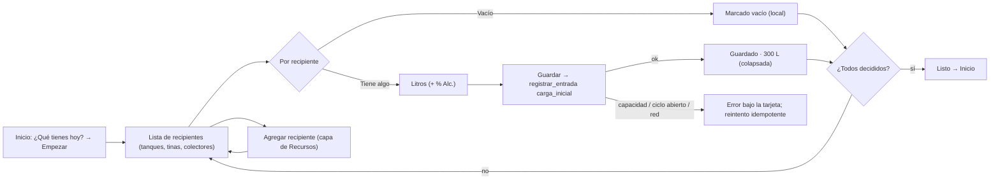

# Brief funcional · PRIMER ARRANQUE "¿Qué tienes hoy?" · r01

**Ruta:** R1 · **Fidelidad:** F2 · **Fecha:** 2026-09-27
**Fuentes leídas:** `docs/PULZ_MAESTRO.md` §4.4, §4.6, §5.1, §8.3, §11.1, §13.2 #2, §16 Fase 4 · `docs/DUDAS.md` #7 · `0015_rpc_entradas.sql` (`registrar_entrada`: `carga_inicial`, material por kind — `granel` → tanque, `fermentado` → tina y abre ciclo, `destilado` → colector con su clase; idempotente por `idempotency_key`; `check_capacity`; folio automático) · `0025` (`recurso_en_uso`) · `resources` (0006) · rondas shell/r01 (Inicio sin lotes → "Empezar") y configuracion/r01 (RecursosPage, capa de alta) · registry (27 candidate).

## Enunciado

Un dueño que acaba de crear su empresa necesita decir qué hay **hoy** en sus
tanques, tinas y colectores, porque el sistema solo sirve si arranca con la
realidad del palenque (litros que ya existen) y no desde cero.

## Pregunta de diseño

¿Puede el dueño, el día uno y sin ayuda, dejar registrado lo que hay en cada
recipiente (o marcarlo vacío) en menos de 5 minutos, sin inventar datos que
no tiene, y retomarlo si lo deja a medias?

- **Verbo principal:** registrar una carga inicial por recipiente.
- **Resultado verificable:** cada recipiente queda «vacío» o con un lote de
  origen `carga_inicial` y su saldo; Inicio deja de ofrecer "¿Qué tienes
  hoy?"; Granel/Fermentación (Fase 5) muestran esos saldos.
- **Dato/acción dominante:** por recipiente, **litros** (y % Alc. si es
  líquido destilado o granel). Una primaria por vista: «Guardar» en cada
  recipiente con datos; al final «Listo».

## Usuarios y permisos

| Usuario | Necesita | Permiso (RLS/RPC real) |
|---|---|---|
| Admin / titular | arrancar su palenque | `registrar_entrada`: admin y productor |
| Productor | puede hacerlo también (rpc_guard) | sí |
| Operador | no | `NO_PERMITIDO` |

## Estructura (una lista, no un asistente)

`/e/:slug/arranque` (shell, destino Inicio, título «¿Qué tienes hoy?»).
Un solo bloque introductorio («Di qué hay en cada uno. Lo que no tenga nada,
márcalo vacío. Puedes dejarlo a medias y volver.») y **una tarjeta por
recipiente activo** de tipo tanque, tina o colector (hornos, molinos y
alambiques no guardan líquido: no aparecen). Cada tarjeta:

- Código y tipo (p. ej. «Tanque 1 · acero inoxidable · 1,000 L»).
- Segmento de 2: **Vacío** · **Tiene algo**.
- Con «Tiene algo»: **Litros** (number-field, unidad L) y, si es tanque o
  colector, **% Alc.** (number-field, %; opcional pero recomendado). Tina:
  solo litros (fermentado; abre un ciclo sin formulación, DUDAS #7). Colector:
  la clase la da el recurso; se muestra, no se pide.
- Primaria «Guardar» (page-primary no: la tarjeta tiene su propio Guardar;
  en compact es ancho completo dentro de la tarjeta). Al guardar → estado
  «Guardado · 300 L» y la tarjeta se colapsa; se puede reabrir para ver,
  no para editar (una carga inicial no se corrige aquí: ajustes van por
  Granel, Fase 5).
- «Vacío» se guarda localmente (no es dato de la base: un recipiente vacío
  no crea nada) y colapsa la tarjeta como «Vacío».

Arriba: progreso en texto «3 de 6 recipientes decididos». Abajo: «Agregar
recipiente» (abre la **misma capa** de alta de Recursos) y, cuando todos
están decididos, «Listo, ir a Inicio». Si la empresa no tiene recipientes,
estado vacío con «Agregar recipiente» como primaria.

Idempotencia: cada tarjeta genera su `idempotency_key` al abrirse
(`crypto.randomUUID`) y la guarda en `localStorage` con el estado local
(vacío/guardado/pendiente) por empresa; reintentar tras un fallo de red no
duplica; reanudar muestra lo mismo.

## Estados

Carga (esqueleto de tarjetas) · sin recipientes (vacío) · tarjeta pendiente
/ con datos / guardando / guardada / vacía · error de guardado por tarjeta
(capacidad estricta rebasada `CAPACIDAD:`, tina con ciclo abierto
`NO_PERMITIDO: la tina … ya tiene un ciclo abierto` → se muestra como «esta
tina ya tiene contenido registrado» y se colapsa como guardada) · sin
conexión (primarias deshabilitadas; lo escrito se conserva) · solo lectura
(pantalla en modo ver: «La suscripción venció») · sin permiso (operador) ·
ya arrancó (la empresa ya tiene lotes: se puede entrar igual por URL —
sirve para añadir recipientes nuevos — con aviso «Ya tienes registros; esto
solo agrega cargas iniciales a recipientes vacíos») · texto largo (código
largo).

## Flujo anterior / posterior

Antes: Inicio sin lotes → «Empezar»; o Configuración → Recursos (enlace
«Registrar lo que hay»). Después: Inicio con lotes (Fase 5), Granel muestra
saldos; Fermentación muestra la tina en ciclo.

## Riesgo por acción

| Acción | Tipo | Confirmación |
|---|---|---|
| Guardar carga inicial | **irreversible aquí** (crea lote y saldo; se corrige en Granel con un ajuste, Fase 5) | ninguna modal: el botón dice «Guardar 300 L en Tanque 1» y la tarjeta muestra lo guardado |
| Marcar vacío | local, reversible | ninguna |
| Agregar recipiente | reversible (desactivar) | ninguna |
| Listo | navegación | ninguna |

## Continuidad

| Situación | Comportamiento |
|---|---|
| Conexión lenta | botón ocupado por tarjeta; las demás siguen editables |
| Sin conexión | se puede escribir; Guardar deshabilitado con motivo; nada se pierde (localStorage) |
| Error | bajo la tarjeta, con causa; reintentar con la misma `idempotency_key` |
| Sesión reanudada | la lista recalcula desde `recurso_en_uso` (saldo > 0 = guardado) + estado local (vacíos) |
| Cambio de tamaño | tarjetas en una columna en compact, dos en expanded |

## Alcance MoSCoW

- **Must:** lista por recipiente con vacío/tiene algo; litros y % Alc.; guardar por tarjeta con idempotencia; progreso; agregar recipiente; Listo; estados.
- **Should:** reanudación por localStorage; aviso de capacidad antes de guardar (litros > capacidad con política estricta → error del servidor; flexible → aviso amarillo local).
- **Could:** fecha real de la carga («desde cuándo está ahí»); nota.
- **Won't:** compras de granel con certificado (es Granel, Fase 5); maguey/cocido/formulación iniciales (§4: kg, otra ronda); corregir litros ya guardados.

## Hechos · Supuestos · Incógnitas

**Hechos:** `registrar_entrada(p_org, p_idem, now(), material, recurso, litros, abv?)` con `p_origen = 'carga_inicial'`; material por kind; tina → ciclo; colector → clase del recurso; folio automático (G-/FER-/DES-); `check_capacity` según política; operador → `NO_PERMITIDO`; `recurso_en_uso` da saldo y ciclos.
**Supuestos:** (1) un recipiente vacío no crea nada en la base (no hay «lote vacío»); (2) % Alc. opcional en la carga inicial (el esquema lo permite) pero se pide para tanque/colector; (3) la fecha de la carga es «ahora» (Could: fecha real).
**Incógnitas:** (1) ¿el dueño quiere capturar también maguey en piso u horneadas a medias el día uno? (fuera: otra ronda); (2) ¿una tina «que ya fermentaba» necesita Brix/actividad inicial? (DUDAS #7: no por ahora).

---

# User flow · Arrancar el palenque

**Entrada:** Inicio sin lotes → «Empezar» · **Endpoint observable:** todos los recipientes decididos; Inicio muestra «Hoy» normal.

| Paso | Intención | Error posible | Recuperación | ¿Se puede volver? |
|---|---|---|---|---|
| Lista | ver qué recipientes tengo | sin recipientes | vacío con «Agregar recipiente» | sí (Inicio) |
| Vacío / Tiene algo | decidir rápido | — | cambiar antes de guardar | sí |
| Guardar | dejar el saldo real | capacidad estricta; ciclo abierto; sin señal | mensaje con causa; reintento con la misma clave | no (irreversible aquí; Granel corrige) |
| Listo | terminar | quedan pendientes | «Te faltan 2; puedes volver después» | sí |
