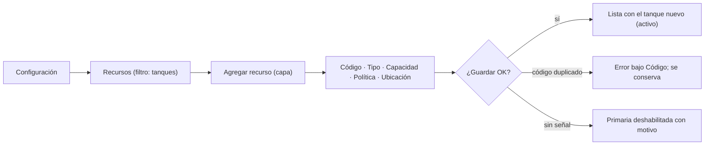
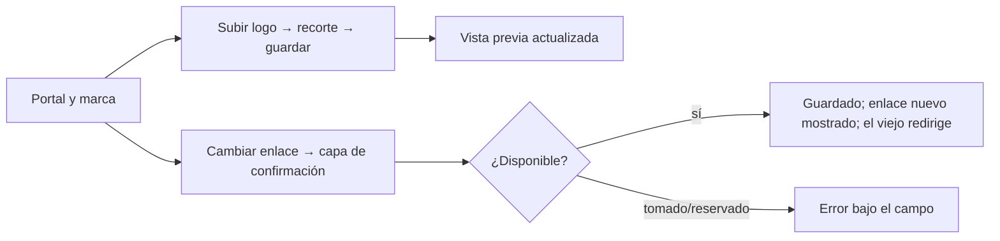
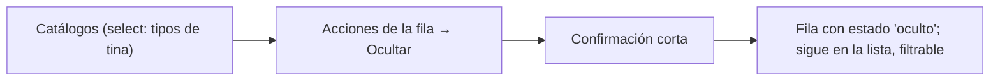

# Brief funcional · CONFIGURACIÓN (recursos, catálogos, ajustes, portal y marca) · r01

**Ruta:** R1 · **Fidelidad:** F2 · **Fecha:** 2026-09-27
**Fuentes leídas:** `docs/PULZ_MAESTRO.md` §3, §5.2, §7.1, §7.3, §10.2–§10.3, §11.1, §13.2 #8, §16 Fase 4 · `docs/plan/FASE-4.md` (tabla "lo que el esquema ya resuelve") · esquema real: `0002` (`organizations`, `organization_settings`, `organization_slug_history`), `0004` (`catalog_items`, `movement_concepts`, `species`), `0005` (`predios`, `suppliers`, `supplies`), `0006` (`resources`, `resources_check_type`), `0013` (RLS: admin escribe recursos/catálogos/ajustes/marca; admin y productor predios/proveedores/insumos; nadie borra), `0024` (bucket `branding`) · `supabase/tests/configuracion.test.sql` (33/33) · registry (20 candidate) · shell/r01 (índice provisional de Configuración) · `coco.data_contract`.

## Enunciado

El administrador de un palenque necesita definir con qué trabaja (hornos,
tinas, alambiques, tanques, tipos, conceptos, especies, predios, proveedores,
insumos), cómo mide y avisa (ajustes) y cómo se ve su portal (marca, logo,
enlace), porque sin eso nadie puede registrar nada y hoy solo existe Equipo.

## Pregunta de diseño

¿Puede un dueño nuevo dejar listo su palenque (al menos un tanque y sus
catálogos base) en su primera sesión, sin manual, y puede después cambiar
una cosa (renombrar una tina, subir el logo, cambiar el enlace) en ≤3
toques desde Inicio?

- **Verbo principal:** dar de alta / editar / desactivar un elemento de
  configuración; subir el logo; cambiar el enlace del portal.
- **Resultado verificable:** el elemento aparece en su lista con su estado;
  la base lo acepta (RLS + triggers); el portal muestra logo y enlace nuevos.
- **Dato/acción dominante:** la lista de la sección con **una** primaria
  «Agregar …»; en Portal y marca, «Guardar cambios».

## Usuarios y permisos (RLS real, 0013; §11.1)

| Sección | admin | productor | operador |
|---|---|---|---|
| Recursos | crear/editar/desactivar | ver | ver |
| Catálogos: tipos de recurso, conceptos de movimiento, especies | crear/editar/ocultar | ver | ver |
| Catálogos: predios, proveedores, insumos | crear/editar/desactivar | crear/editar/desactivar | ver |
| Ajustes | editar | ver | ver |
| Portal y marca | editar, logo, slug | — | — |
| Equipo | ya existe | — | — |

Productor y operador **sí ven** Recursos y Catálogos (lectura: `is_member`),
pero el índice de Configuración es solo admin (shell/r01). Decisión de esta
ronda: **Configuración sigue siendo solo admin**; predios/proveedores/insumos
para el productor entran cuando la Fase 5 los necesite en su propia pantalla
(Maguey: predio y proveedor al recibir). Registrado como supuesto.

## Estructura (§13.2 #8 + esquema)

`/configuracion` (índice, ya existe) → cuatro secciones, misma estructura:
**lista + capa de tarea** (reutiliza `list-stack`, `task-layer`, `row-menu`).

1. **Recursos** `/configuracion/recursos`: un filtro por tipo (segmento no:
   son 6 → `select` nativo o pestañas de texto; se decide: **select**),
   lista con código, tipo (catálogo), capacidad + política, clase (colector)
   y estado (activo/inactivo). Alta/edición en capa: Código («como le
   dicen», único por empresa), Tipo (select del catálogo `tipo_<kind>`),
   Capacidad (número + unidad L/kg), Política (segmento 3: estricta ·
   flexible · libre, con ayuda), Clase de líquido (solo colector: select 4),
   Ubicación. Menú de fila: Editar… · Desactivar / Reactivar. Nunca borrar.
2. **Catálogos** `/configuracion/catalogos`: select del catálogo (tipo de
   horno, molino, tina, alambique, colector, tanque, proveedor, adjunto,
   unidad de insumo; conceptos de movimiento; especies; predios;
   proveedores; insumos) → lista con nombre y estado, y las columnas propias
   (conceptos: dirección, «crea lote», «pide resultado», «pide contraparte»;
   especies: nombre científico; predios: municipio; proveedores: tipo y
   teléfono; insumos: unidad). Alta/edición en capa con los campos de la
   tabla real. Los copiados de plantilla se pueden **ocultar**
   (`active=false`), no borrar; los propios igual.
3. **Ajustes** `/configuracion/ajustes`: un formulario de una columna con
   los 10 campos de `organization_settings` agrupados: *Mediciones* (modo
   mínimo/completo, hora del recordatorio 0–23, días esperados de
   fermentación, rangos Brix), *Destilación* (¿capturas puntas?, avisar
   segunda pasada mezclada, rango % Alc.), *Folios* (decisión por defecto
   conservar/nuevo). Guardar al final (una primaria); validación al salir.
4. **Portal y marca** `/configuracion/portal`: Nombre, Estado (texto),
   Mensaje de bienvenida (≤140, contador), Color (campo de color + vista
   previa de la línea de acento; la regla de contraste la impone el
   sistema: solo acento), Logo (subir → recorte cuadrado → 512 px → Storage
   `branding/<org>/logo.<ext>`; quitar), **Enlace del portal** (slug) con
   confirmación en capa: «El enlace viejo seguirá funcionando y nadie más
   podrá usarlo». Vista previa del portal (marca como la ve la gente).

## Estados

Carga (esqueleto de lista/formulario) · vacío por catálogo («Aún no hay
insumos») · error de carga con Reintentar · error de guardado (duplicado:
`unique (organization_id, code)` / `(catalog, name)`; tipo incorrecto por
trigger; slug tomado o reservado; logo >2 MB o tipo no permitido) bajo el
campo · sin permiso (no admin por URL) · sin conexión (banner; todo es
escritura: primaria deshabilitada con motivo) · solo lectura (vencida: ver,
no editar) · texto largo (códigos de 40, nombres de catálogo largos) ·
confirmación (desactivar recurso en uso, cambiar slug).

## Flujo anterior / posterior

Antes: índice de Configuración (shell). Después: primer arranque
(`arranque/r01`) usa Recursos para crear tanques/tinas al vuelo; Fase 5
consume catálogos.

## Riesgo por acción

| Acción | Tipo | Confirmación |
|---|---|---|
| Crear / editar | reversible (editar de nuevo) | ninguna |
| Desactivar recurso / ocultar catálogo | reversible (reactivar) | corta si el recurso tiene saldo o ciclo abierto (dato: `resource_balance` > 0 o `fermentation_cycles.status <> 'cerrado'`) — **incógnita 2**: hoy no hay vista que lo diga; se muestra confirmación genérica |
| Cambiar slug | reversible pero público (el viejo redirige) | capa con la explicación y el enlace nuevo |
| Quitar logo | reversible (subir otro) | ninguna |
| Guardar ajustes | reversible | ninguna |

## Continuidad

| Situación | Comportamiento |
|---|---|
| Conexión lenta | esqueleto; guardar con botón ocupado; sin doble envío |
| Sin conexión | listas visibles (lo último cargado); nada se puede guardar; banner |
| Error de guardado | mensaje bajo el campo o `role=alert` en la capa; lo escrito se conserva |
| Sesión reanudada | vuelve a la sección; la capa no se restaura |
| Cambio de tamaño | capa drawer ↔ hoja, misma instancia |

## Alcance MoSCoW

- **Must:** las 4 secciones con lista + alta/edición/desactivar; logo a Storage; cambio de slug con confirmación; ajustes completos; estados; RLS respetada.
- **Should:** recorte cuadrado del logo en el navegador; vista previa del portal; contador del mensaje; búsqueda en listas largas (catálogos de plantilla ya traen ~40 elementos).
- **Could:** reordenar catálogos (`sort_order`) arrastrando; importar recursos en lote.
- **Won't:** borrar cualquier cosa; editar plantillas de plataforma; cobro (Fase 7); predios/proveedores para productor (Fase 5).

## Hechos · Supuestos · Incógnitas

**Hechos:** tablas y CHECKs reales; `resources_check_type` valida el tipo por kind; colector exige `liquid_class`; `brand_color` `#RRGGBB`; mensaje ≤140; slug `^[a-z0-9]([a-z0-9-]{1,38}[a-z0-9])$` sin `--`; slug viejo → historial y 301; bucket `branding` público, 2 MB, png/jpeg/webp; nadie tiene DELETE.
**Supuestos:** (1) Configuración solo admin también para catálogos que el productor podría editar; (2) select nativo (estilizado con tokens) para listas >3; (3) desactivar sin comprobar uso (incógnita 2).
**Incógnitas:** (1) ¿el dueño quiere reordenar catálogos? (2) ¿hace falta una vista «recurso en uso» para avisar antes de desactivar? (3) ¿el nombre comercial (`organizations.name`) también se edita aquí o solo el dueño de plataforma? — supuesto: sí, aquí (RLS lo permite).

---

# User flow 1 · Dar de alta un tanque

# User flow 2 · Subir el logo y cambiar el enlace

# User flow 3 · Ocultar un tipo de catálogo que no usan

