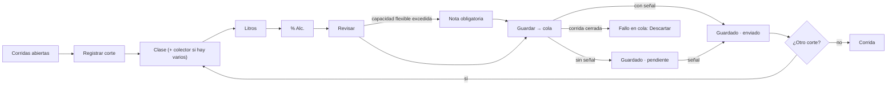

# Brief funcional · DESTILACIÓN: corridas y cortes · r01

**Ruta:** R1 · **Fidelidad:** F2 · **Fecha:** 2026-09-27
**Fuentes leídas:** `docs/PULZ_MAESTRO.md` §2.1, §3 (corrida, corte, colector, «ya mezcal»), §4.5, §8.3, §11.1, §12.1, §13.1–13.3, §16 Fase 5 · `docs/plan/FASE-5.md` · `0018_rpc_destilacion.sql` (`abrir_corrida(alambique, pasada, recursos[], lotes[], litros[], nota?, folio?)`: tinas o colectores; `SALDO_INSUFICIENTE`; capacidad del alambique dura si es estricta, aviso `excede_capacidad` si flexible; `mezcla_clases_2a` en 2ª con ordinario y colas si `warn_mixed_second_pass`; la tina cargada pasa a `en_vaciado` · `registrar_corte(corrida, clase, litros, abv, colector, nota?, folio?)`: **solo a colector de la misma clase**, `puntas` solo con `record_puntas`, acumula en el lote vivo salvo que se haya cargado a la misma corrida, `check_capacity` del colector, linaje proporcional · `cerrar_corrida`; las tres para admin, productor **y operador**) · `0019` (`transferir` colector → tanque, admin/productor: «ya mezcal» pasa a granel por transferencia, ronda granel) · `0026` (`corridas`, `colectores_con_saldo`, `tinas_en_uso`) · `organization_settings` (`record_puntas`, `warn_mixed_second_pass`) · `shared/offline/` (la cola ya acepta `registrar_corte`) · ronda fermentacion/r01 (piezas `step-flow`, `big-number-field`, `datetime-field`, `soft-warning-note`, chips de cola).

## Enunciado

Quien destila (el operador casi siempre) necesita **abrir una corrida cuando
hay olla libre con lo que haya en el origen, registrar cada corte al salir
del alambique —a veces sin señal— y cerrarla**, porque el corte es el dato
que decide qué es mezcal, qué se redestila y qué se desecha, y se captura
junto al alambique, no en un escritorio.

## Pregunta de diseño

¿Puede el operador, junto al alambique y sin señal, registrar un corte
(clase, litros, % Alc.) en menos de 20 segundos sin equivocarse de
colector, y ver de un vistazo qué corridas están abiertas, qué se ha cortado
y qué hay en cada colector?

- **Verbo principal:** registrar un corte (de una corrida abierta).
- **Resultado verificable:** pata `corte` en el ledger hacia el colector de
  su clase; la corrida muestra el corte; el colector suma litros; sin señal
  queda en la cola y llega al reconectar.
- **Dato dominante:** en la lista, **corridas abiertas** (alambique, pasada,
  cargado vs. cortado); en el corte, **el número que se captura**.

## Usuarios y permisos (rpc_guard real)

| Usuario | Puede | No puede |
|---|---|---|
| Operador | abrir corrida, cortes, cerrar; ver todo | pasar un colector a granel (transferir: admin/productor) |
| Productor / Admin | todo | — |

## Estructura

Cuatro vistas dentro del shell (destino Destilación, `i-destila`):

1. **`/e/:slug/destilacion` — Corridas.** «Corridas abiertas» (fila: folio,
   alambique, pasada, abierta cuándo y por quién, **cargado N L** desde qué
   orígenes, **cortado M L** por clase, chip abierta; acciones: «Registrar
   corte», menú: ver, cerrar corrida) · «Colectores con contenido» (colector,
   clase, lote vivo, litros, % Alc. declarado; «Pasar a granel» → Granel
   (ronda 3), solo admin/productor) · «Últimas corridas» (cerradas, 10 más
   recientes: folio, fecha, pasada, cargado → cortado; ver). Primaria de la
   vista: **Abrir corrida** (FAB en compact; botón en cabecera en ≥600).
2. **`/e/:slug/destilacion/abrir` — Abrir corrida.** Alambique (select con
   capacidad y política), pasada (1ª / 2ª), **orígenes con litros**: tinas
   con contenido (listas primero; fermentando/en vaciado después) y
   colectores con saldo, cada uno con su lote y saldo, campo de litros;
   total vs. capacidad (estricta: no se podrá; flexible: aviso con nota
   conocido antes); 2ª con ordinario y colas → aviso `mezcla_clases_2a` con
   nota conocido antes (si el ajuste avisa); folio opcional; ¿cuándo pasó?
   → `abrir_corrida`. Requiere señal (consume saldos). Página, no capa.
3. **`/e/:slug/destilacion/:corrida` — Corrida.** Cabecera: folio,
   alambique, pasada, estado, abierta/cerrada cuándo y por quién; KPIs
   cargado / cortado / por clase; orígenes (recurso, lote, litros); cortes
   (hora, clase, litros, % Alc., colector, lote, quién; chip pendiente /
   fallo); primaria «Registrar corte» (abierta); acción «Cerrar corrida»
   (irreversible: diálogo con Cancelar como primaria; muestra cargado vs.
   cortado y que la diferencia no se registra como lote).
4. **`/e/:slug/destilacion/:corrida/corte` — Corte.** `step-flow`: Clase
   (mezcal · ordinario · colas · puntas solo si `record_puntas`; el
   colector se elige solo por clase, y si hay varios de la misma clase se
   pide) → Litros (número grande) → % Alc. (número grande) → Revisar
   (resumen; colector con saldo actual y capacidad → aviso
   `excede_capacidad` con nota si es flexible y se pasa; nota; foto
   opcional; ¿cuándo pasó?). Guardar **siempre encola** → «Corte guardado ·
   enviado / pendiente de enviar» → «Registrar otro corte» / «Volver a la
   corrida».

## Estados

Lista: carga · sin alambiques (→ Recursos) · sin corridas abiertas (con
primaria Abrir corrida) · default · sin conexión (instantánea; Abrir y
Cerrar deshabilitados con motivo; cortes sí) · cortes pendientes / fallo
(chip y «Corregir») · solo lectura · contenido largo. Abrir: sin orígenes
con líquido · capacidad estricta rebasada (bloquea con texto) · aviso
capacidad flexible (nota) · aviso mezcla 2ª (nota) · error de saldo del
servidor. Corrida: abierta sin cortes · con cortes · cerrada (solo lectura) ·
confirmar cerrar. Corte: pasos · sin colector de esa clase (bloquea con
enlace a Recursos) · puntas apagadas (no aparece) · revisar con aviso ·
guardado enviado / pendiente / fallo · corrida ya cerrada (dominio).

## Flujo anterior / posterior

Antes: Fermentación (tina lista) o colectores con ordinario/colas. Después:
colector mezcal → Granel «Pasar a granel» (transferir, ronda 3); ordinario y
colas → nueva corrida de 2ª; cerrar ciclo de la tina vaciada (Fermentación).

## Riesgo por acción

| Acción | Tipo | Confirmación |
|---|---|---|
| Abrir corrida | consume saldos (irreversible; se corrige con ajustes en Granel/Fase 6) | resumen en la misma página; el botón dice «Abrir corrida en Alambique 1 con 290 L» |
| Registrar corte | crea lote/pata (no se anula: se corrige con ajuste) | Revisar |
| Cerrar corrida | **irreversible** (no se reabre) | diálogo: cargado vs. cortado; Cancelar primaria |
| Pasar a granel | ronda 3 | — |

## Continuidad

| Situación | Comportamiento |
|---|---|
| Sin conexión | lista y corrida desde la instantánea; **cortes** funcionan (cola); abrir y cerrar deshabilitados con motivo |
| Error de dominio en cola (corrida cerrada desde otro teléfono) | fila en fallo con causa; Descartar |
| Sesión reanudada | la cola sigue; se envía al abrir |
| Cambio de tamaño | filas apiladas <1024; detalle a dos columnas ≥1024; corte centrado a 520 |

## Alcance MoSCoW

- **Must:** lista con corridas abiertas, colectores y últimas; abrir corrida con orígenes y avisos conocidos antes; corrida con cortes; corte por pasos con cola; cerrar corrida.
- **Should:** foto opcional en el corte; «Corregir» de cola.
- **Could:** rendimiento de la corrida (cortado / cargado) como texto.
- **Won't:** anular un corte (no hay RPC; ajuste en Granel/Fase 6); transferir desde aquí (Granel); reabrir corrida.

## Hechos · Supuestos · Incógnitas

**Hechos:** el corte solo va a un colector de su clase; «ya mezcal» a granel es `transferir`; puntas dependen de `record_puntas`; una tina cargada pasa a `en_vaciado`; el alambique no guarda saldo; `corridas` trae orígenes y cortes en jsonb.
**Supuestos:** (1) si hay un solo colector de la clase, se elige solo; (2) el rendimiento no se muestra como % (Could); (3) las «últimas corridas» son 10, sin paginación.
**Incógnitas:** (1) ¿quieren registrar «vinazas»/pérdida al cerrar? (no hay campo: se declara como diferencia, no se guarda); (2) ¿colector por defecto por alambique? (no: por clase).

---

# User flow · Cortar

**Entrada:** Corridas → «Registrar corte» (o desde la corrida) · **Endpoint observable:** el corte aparece en la corrida y en el colector; sin señal, «pendiente» hasta reconectar.

| Paso | Intención | Error posible | Recuperación | ¿Se puede volver? |
|---|---|---|---|---|
| Clase | decir qué salió | sin colector de esa clase | bloqueo con enlace a Recursos | sí |
| Litros / % Alc. | capturar el número | fuera de rango (0–100 %) | error al salir | Atrás conserva |
| Revisar | ver todo junto | falta nota (aviso) | campo marcado | sí |
| Guardar | dejarlo hecho | sin señal; dominio | cola | no (ajuste en Granel) |

# User flow · Abrir y cerrar

Abrir: Corridas → Abrir corrida → alambique · pasada · orígenes con litros → avisos conocidos → `abrir_corrida` → Corrida. Cerrar: Corrida → Cerrar corrida → diálogo (cargado vs. cortado) → `cerrar_corrida` → Corridas (pasa a «Últimas»).
