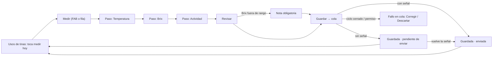

# Brief funcional · FERMENTACIÓN: usos de tinas y medición diaria · r01

**Ruta:** R1 · **Fidelidad:** F2 · **Fecha:** 2026-09-27
**Fuentes leídas:** `docs/PULZ_MAESTRO.md` §2 (principios), §4.3–4.4, §8.3, §11.1, §12.1, §13.1–13.3, §16 Fase 5 · `docs/plan/FASE-5.md` · `docs/DUDAS.md` #7 · `0017_rpc_fermentacion.sql` (`registrar_medicion(ciclo, día, modo, actividad?, variables[], zonas[], números[], valores[], nota?)` — admin/productor/operador; solo ciclos `fermentando`/`lista`; `brix_fuera_rango` pide nota; `anular_medicion(motivo)` y `declarar_tina_lista`/`cerrar_ciclo` — admin/productor) · `0016` (`registrar_formulacion(molino, cocido[], kg[], agua, tinas[], litros[], insumos?, método?, nota?, folios?)`) · `0015` (`registrar_entrada('fermentado', tina)` — tina que ya fermentaba) · `0026` (`tinas_en_uso`, `mediciones_del_ciclo`) · `organization_settings` (`measurement_mode`, `fermentation_expected_days`, `brix_warn_*`, `measurement_reminder_hour`) · `shared/offline/` (cola, instantánea, `useCola`) · rondas shell/r01, configuracion/r01, arranque/r01 · registry (29 candidate).

## Enunciado

Quien fermenta (operador, productor o dueño) necesita **medir cada tina todos
los días con una mano y a veces sin señal**, y saber de un vistazo cuáles le
faltan hoy, porque una fermentación sin medir es una fermentación a ciegas y
el palenque no tiene escritorio ni cobertura garantizada.

## Pregunta de diseño

¿Puede una persona con el teléfono en una mano, bajo el sol y sin señal,
registrar la medición de una tina en menos de 30 segundos y un solo gesto
por pantalla, ver cuáles tinas le faltan hoy, y confiar en que lo capturado
llega una sola vez cuando vuelve la señal?

- **Verbo principal:** medir una tina (hoy).
- **Resultado verificable:** una fila en `fermentation_measurements` con sus
  lecturas, quién y cuándo pasó; la tina deja de aparecer en «toca medir
  hoy»; sin señal, la captura queda en la cola y llega al reconectar.
- **Dato dominante:** por tina, **si ya se midió hoy** y **qué día del ciclo
  va**; en la medición, **el número que se está capturando** (grande).

## Usuarios y permisos (rpc_guard real)

| Usuario | Puede | No puede |
|---|---|---|
| Operador | medir; ver todo | anular, declarar lista, cerrar ciclo, formular, entrada de tina que ya fermentaba (`NO_PERMITIDO`) |
| Productor / Admin | todo lo anterior | — |

## Estructura

Tres vistas dentro del shell (destino Fermentación, `i-tina`):

1. **`/e/:slug/fermentacion` — Usos de tinas.** No lista tinas: lista **ciclos
   abiertos** (`tinas_en_uso`), agrupados por lo que hay que hacer:
   «Toca medir hoy» (sin medición válida hoy, en `fermentando`) → «Ya medidas
   hoy» → «Listas o en vaciado». Cada fila: tina, folio, litros, **día N**
   (calculado en el navegador desde `started_at`; «de ~7» con
   `fermentation_expected_days`), última medición (cuándo · °C · Brix ·
   actividad) y chip de estado (fermentando / lista / en vaciado; **pendiente
   de enviar** si hay captura en cola). Acciones por fila: **Medir** y menú
   «Más» (ver mediciones, declarar lista, cerrar ciclo — solo si el rol
   puede). Primaria de la vista: **Medir** (FAB en compact; botón en la
   cabecera en medium/expanded) → abre la medición de la primera tina de
   «toca medir hoy» con la tina visible y cambiable en la cabecera. Pie:
   «Llenar tinas (formulación)» y «Tina que ya fermentaba» (admin/productor).
2. **`/e/:slug/fermentacion/:ciclo` — Uso de tina.** Cabecera con tina,
   folio, día, litros, estado, formulación de origen; primaria «Medir hoy»;
   lista de mediciones (`mediciones_del_ciclo`, la más reciente arriba; las
   anuladas tachadas con motivo); acciones: anular (pide motivo), declarar
   lista, cerrar ciclo (tina vaciada: libera la tina).
3. **`/e/:slug/fermentacion/:ciclo/medir` — Medición.** Pensada para una
   mano: **un concepto por pantalla**, número grande, teclado numérico,
   «Siguiente» en el pulgar. Cabecera fija: tina · día N (corregible) ·
   «¿Cuándo pasó? ahora» (cambiar). Modo **mínimo** (ajuste de la empresa):
   Temperatura → Brix → Actividad (1–6 con etiqueta) → Revisar. Modo
   **completo**: Temperatura superficie (3 lecturas, promedio en vivo) →
   Temperatura fondo (3) → Brix superficie (3) → Brix fondo (3) → Actividad
   · Dulzor · Acidez (1–6) → Revisar. Revisar: resumen, nota opcional, foto
   opcional, aviso `brix_fuera_rango` **antes de guardar** (rangos de la
   empresa: el navegador ya sabe que pedirá nota) y «Guardar medición».
   Al guardar: la captura **siempre entra a la cola** y la pantalla dice
   «Guardada · enviada» o «Guardada · pendiente de enviar»; vuelve a la lista.

**Formulación (llenar tinas)** — página `/e/:slug/fermentacion/formular`
(no una hoja: es larga): molino, lotes de agave cocido con kg (saldo visible),
agua (L), insumos opcionales con cantidad, reparto a **tinas libres** con
litros y folio opcional, método/nota, ¿cuándo pasó? → `registrar_formulacion`.
Requiere señal. **Tina que ya fermentaba** — capa corta: tina libre, litros,
cuándo → `registrar_entrada('fermentado')` (DUDAS #7).

## Estados

Lista: carga · sin tinas en uso (con tinas: «Llenar tinas» / «Tina que ya
fermentaba»; sin tinas: «Agrega tinas en Configuración → Recursos») · default
· todas medidas hoy · sin conexión (instantánea «datos de hace 15 min»;
Medir habilitado; formular deshabilitado con motivo) · capturas en cola
(banner «2 pendientes de enviar · 1 falló» y chip por fila) · fallo en cola
con motivo y «Corregir» (agrega la nota que pedía el aviso) · solo lectura ·
operador (sin formular ni cerrar) · contenido largo. Medición: cada paso ·
revisar con aviso Brix → nota obligatoria · guardada enviada / pendiente ·
error de dominio (ciclo ya cerrado: «esta tina ya no está fermentando»).
Detalle: sin mediciones aún · medición anulada · confirmar declarar lista ·
confirmar cerrar ciclo.

## Flujo anterior / posterior

Antes: Inicio «toca medir» (Fase 5, ronda inicio-hoy) o barra inferior →
Fermentación. Después: tina lista → Destilación la carga (ronda 2) → en
vaciado → cerrar ciclo libera la tina → formulación nueva.

## Riesgo por acción

| Acción | Tipo | Confirmación |
|---|---|---|
| Guardar medición | reversible (se anula con motivo) | ninguna; resumen en «Revisar» |
| Anular medición | con deshacer no (queda anulada) | pide motivo (la RPC lo exige) |
| Declarar lista | reversible en la práctica (se sigue midiendo) | inline: «La tina pasa a lista; se puede seguir midiendo» |
| Cerrar ciclo | **irreversible** (libera la tina, cierra el lote) | diálogo con texto: «Tina 1 queda libre; FER-T1-001 termina» |
| Formulación | crea ciclos y lotes; se corrige en Granel/ajustes (Fase 6) | resumen antes de guardar |

## Continuidad

| Situación | Comportamiento |
|---|---|
| Sin conexión | lista desde la instantánea con «datos de hace X»; medir funciona (cola); formular/lista/cerrar deshabilitados con motivo |
| Conexión lenta | guardar es instantáneo (cola); el envío corre atrás |
| Error | aviso blando → nota → reintento con la **misma** clave; error duro → fallo en cola con «Corregir» / «Descartar» |
| Sesión reanudada | la cola sigue en IndexedDB; se envía al abrir |
| Cambio de tamaño | mismo flujo de pasos; en expanded centrado a 520 px |
| Zoom 200 % | números grandes en `rem`; pasos de una columna |

## Alcance MoSCoW

- **Must:** lista por hacer hoy; medición en pasos (dos modos) con cola; detalle con mediciones y anulación; declarar lista; cerrar ciclo; formulación; tina que ya fermentaba; aviso Brix con nota; instantánea offline.
- **Should:** foto opcional en revisar; corregir un fallo de cola desde la lista.
- **Could:** gráfica de Brix por día en el detalle (texto primero: tabla).
- **Won't:** recordatorio push; edición de una medición (se anula y se captura otra); gráficas comparativas.

## Hechos · Supuestos · Incógnitas

**Hechos:** `registrar_medicion` exige `p_dia`, `p_modo` y arreglos paralelos de lecturas; `dulzor/acidez` 1–6; anular pide motivo; `tinas_en_uso` da `started_at` y última medición; la cola envía en orden y no duplica; `measurement_mode` es por empresa.
**Supuestos:** (1) el «día» = días naturales desde `started_at` en la zona del navegador, editable; (2) «hoy» se evalúa con la fecha local del teléfono; (3) el modo lo fija el ajuste de la empresa y la pantalla no lo cambia por medición; (4) foto solo en revisar, tipo «Foto» del catálogo.
**Incógnitas:** (1) ¿el productor quiere ver la curva de Brix? (Could); (2) ¿una medición anulada debe poder «reemplazarse» con un atajo? (no: se captura otra).

---

# User flow · Medir hoy

**Entrada:** Inicio «toca medir» / Fermentación / FAB · **Endpoint observable:** la tina sale de «toca medir hoy»; la operación existe en el servidor una sola vez.

| Paso | Intención | Error posible | Recuperación | ¿Se puede volver? |
|---|---|---|---|---|
| Lista | saber qué falta hoy | sin señal | instantánea con fecha | — |
| Medir (cabecera) | confirmar tina y día | tina equivocada | cambiar tina / día en la cabecera | sí |
| Pasos | capturar un número | valor absurdo | rango de entrada (0–100 °C, 0–40 Brix) y aviso Brix | Atrás conserva lo escrito |
| Revisar | ver todo junto | falta nota (aviso) | campo de nota marcado | sí |
| Guardar | dejarlo hecho | sin señal; dominio | cola: pendiente / fallo con causa | no (se anula) |

# User flow · Llenar tinas (formulación)

Entrada: pie de Fermentación → «Llenar tinas» → molino · cocido (kg) · agua · insumos · reparto a tinas libres · cuándo → resumen → `registrar_formulacion` → aparecen los ciclos en la lista. Errores: `SALDO_INSUFICIENTE` (kg de cocido), tina con ciclo abierto (`NO_PERMITIDO`), `excede_capacidad` (nota), sin señal (deshabilitado). Se puede cancelar en cualquier momento.
