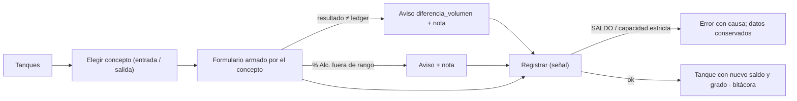

# Brief funcional · GRANEL: tanques y movimientos · r01

**Ruta:** R1 · **Fidelidad:** F2 · **Fecha:** 2026-09-27
**Fuentes leídas:** `docs/PULZ_MAESTRO.md` §2.1, §3 (granel, concepto de movimiento), §5 (5.1 qué pasa en un tanque; 5.2 catálogo; 5.3 compra), §6 (nivel de historia, bitácora), §11.1, §12.1, §13.2 #6, §16 Fase 5 · `0019_rpc_granel.sql` (`transferir(origen, destino, lote, litros, abv?, decisión?, folio nuevo?, nota?)`: hacia tanque o colector de la misma clase; si el destino tiene lote: **conservar** (aporta al que ya está) o **renombrar** (nace uno nuevo con el aporte de los dos); `registrar_movimiento_granel(concepto, tanque, litros, lote?, lote_origen?, recurso_origen?, resultado_l?, resultado_abv?, abv?, decisión?, folio_nuevo?, contraparte?, documento?, proveedor?, proveedor_nombre?, folio_certificado?, organismo?, especie?, predio_declarado?, nota?)`: salida saca del lote vivo; `creates_lot` nace lote (compra → `history = declarada` + `lot_external_sources`; carga inicial); `source_lot` requerido/opcional → unión con `rpc_merge_into`; si no, entra al lote vivo; **entradas con `asks_result` piden `resultado_l`** (`NO_PERMITIDO` si falta) y concilian: diferencia → pata `conciliacion` + aviso `diferencia_volumen` (nota); `resultado_abv` fuera de rango → `abv_fuera_rango` (nota); `asks_counterparty` sin contraparte → `REQUIERE_NOTA:contraparte`; `check_capacity` del tanque; **ambas para admin y productor**) · `0011` (`movement_log`, `lot_declared_abv`) · `0026` (`tanques`, `colectores_con_saldo`) · `movement_concepts` (dirección, `source_lot`, `creates_lot`, `asks_result`, `asks_counterparty`; semilla §5.2) · `organization_settings` (`default_folio_decision`, `abv_warn_*`) · rondas fermentacion/destilacion (piezas, cola, instantánea) · configuracion/r01 (catálogo de conceptos ya editable).

## Enunciado

El dueño o el productor necesita **ver cuánto mezcal tiene en cada tanque
y a qué grado, y registrar cada entrada, salida y transferencia con quién,
cuándo y por qué**, porque el granel es lo que se vende y lo que un
organismo va a preguntar, y el sistema **no calcula el grado**: la persona
declara el volumen y el % Alc. resultantes (§5.1).

## Pregunta de diseño

¿Puede el productor, en un minuto y sin conocer el catálogo de memoria,
registrar cualquier movimiento de granel con los datos que ese concepto
exige y ninguno de más, ver el saldo y el grado vigente de cada tanque con
quién y cuándo lo declaró, y entender qué hizo el sistema cuando el volumen
declarado no cuadró?

- **Verbo principal:** registrar un movimiento de granel (entrada, salida o
  transferencia).
- **Resultado verificable:** pata(s) en el ledger con la operación (quién,
  cuándo pasó, cuándo se sincronizó), el tanque muestra el nuevo saldo y, en
  entradas, el grado declarado; la bitácora lo lista.
- **Dato dominante:** por tanque, **litros y % Alc. declarado vigente** (con
  quién y cuándo); en el formulario, lo que **ese concepto** pide.

## Usuarios y permisos (rpc_guard real)

| Usuario | Puede | No puede |
|---|---|---|
| Admin / Productor | transferir, entradas, salidas, compra | — |
| Operador | ver tanques, saldos, grado e historial | ningún movimiento (`NO_PERMITIDO`); el operador no ve los botones |

## Estructura

Tres vistas dentro del shell (destino Granel, `i-tanque`) más un
formulario por concepto:

1. **`/e/:slug/granel` — Tanques.** Una tarjeta/fila por tanque activo
   (`tanques`): código, capacidad, **litros totales**, lote(s) dentro con
   folio, litros, **% Alc. declarado vigente** («47.0 % · Benito · 18 sep»)
   y nivel de historia como texto (completa / parcial / declarada / sin
   historia); tanque vacío se ve vacío. Acciones por tanque: **Entrada**,
   **Salida**, **Transferir** (menú o botones, admin/productor). Debajo,
   **colectores con contenido** (mezcal → «Pasar a granel» = transferir). Sin
   FAB: la acción depende del tanque (hallazgo). Resumen arriba: «N tanques ·
   X L de granel».
2. **`/e/:slug/granel/:tanque` — Tanque.** Cabecera (saldo, lotes, grado
   vigente con quién y cuándo, capacidad y política), acciones Entrada /
   Salida / Transferir, **historial** (`movement_log` filtrado por el
   tanque: cuándo, concepto o tipo, lote, litros ±, % Alc., quién, nota;
   las patas de conciliación se muestran como «el sistema registró una
   diferencia de −0.2 L»), filtros por lote y persona (Could: fecha).
3. **`/e/:slug/granel/:tanque/movimiento?concepto=…`** — **Movimiento**
   (página): elegir concepto (lista por dirección: entradas / salidas, con
   su comportamiento visible como ayuda: «crea lote», «pide resultado»,
   «pide contraparte»); el formulario **se arma con el concepto**:
   - litros (siempre);
   - lote afectado (si el tanque tiene más de un lote; por defecto el vivo);
   - `source_lot` requerido/opcional → **lote de origen y dónde está**
     (colector o tanque con saldo; para «Unión con otro lote» → decisión
     conservar / renombrar con folio sugerido; `default_folio_decision`);
   - `asks_result` → **volumen resultante** (obligatorio) y **% Alc.
     resultante** (el sistema no calcula el grado; muestra el ledger
     esperado y avisa si la diferencia generará conciliación);
   - `asks_counterparty` → contraparte (cliente, laboratorio, proveedor) y
     documento (remisión, factura, análisis);
   - `creates_lot` con contraparte (compra) → certificado opcional: folio,
     organismo, especie, predio declarado, proveedor del catálogo o nombre;
   - ¿cuándo pasó?, nota (obligatoria si hay aviso: `abv_fuera_rango`,
     `diferencia_volumen`, `excede_capacidad`).
   El botón dice lo que hará: «Sacar 300 L de Tanque 2 (Venta a granel)».
4. **Transferir** (`/granel/transferir?origen=…`): origen (colector con
   saldo o tanque con lote) → destino (tanque, o colector de la misma clase)
   → litros → % Alc. (por defecto el declarado del lote) → si el destino
   tiene lote: **conservar** el folio del destino (sugerido) o **renombrar**
   (folio nuevo, opcional) → ¿cuándo? → nota. El botón dice «Transferir 40 L
   de Colector mezcal a Tanque 1». «Pasar a granel» desde Destilación llega
   aquí con el origen puesto.

Todo requiere señal (§8.3: transferencias, uniones, entradas y salidas
dependen de saldos que decide el servidor). Sin señal: lectura desde la
instantánea y botones deshabilitados con motivo.

## Estados

Tanques: carga · sin tanques (→ Recursos) · con tanques vacíos · default ·
sin conexión · solo lectura · operador (sin botones) · contenido largo
(varios lotes en un tanque). Tanque: sin movimientos · con historial ·
filtros. Movimiento: elegir concepto · formulario por concepto (agua /
puntas / unión / compra / ajuste + / venta / envasado / muestra / merma /
ajuste −) · lote de origen sin saldo · resultado que no cuadra (aviso
`diferencia_volumen` conocido antes: «el ledger quedaría en 1,404 L;
declaras 1,400: se registrará una diferencia de −4 L» + nota) · % Alc. fuera
de rango (nota) · capacidad estricta (bloquea) / flexible (nota) · tanque
vacío para una salida (bloquea) · sin contraparte (bloquea con texto) ·
guardado (vuelve al tanque con aviso) · error del servidor (saldo). Transferir:
origen sin saldo · destino con lote → decisión · conservar / renombrar ·
colector destino de otra clase (no se ofrece) · guardado.

## Flujo anterior / posterior

Antes: Destilación (colector mezcal → «Pasar a granel»); arranque (carga
inicial ya existe como concepto). Después: Trazabilidad (Fase 6: árbol del
lote y completar historia); ajustes de inventario para corregir cortes o
litros (DUDAS #8, #15).

## Riesgo por acción

| Acción | Tipo | Confirmación |
|---|---|---|
| Entrada / salida / transferencia | crea patas (no se borran; se corrige con un ajuste ± o `corregir_operacion` en Fase 6) | el botón dice cantidad, tanque y concepto; resumen en la misma página |
| Unión que renombra | consume los dos lotes en uno nuevo | decisión explícita conservar / renombrar con folios visibles |
| Venta / muestra | irreversible operativamente | contraparte y documento obligatorios (el concepto lo pide) |

## Continuidad

| Situación | Comportamiento |
|---|---|
| Sin conexión | tanques e historial desde la instantánea; todo botón de movimiento deshabilitado con motivo (necesita señal) |
| Error de saldo / capacidad | mensaje con causa bajo el botón; los datos se conservan |
| Aviso blando | nota obligatoria conocida antes (rangos y ledger en la instantánea); si el servidor pide otra, la misma pieza |
| Sesión reanudada | nada en cola (todo requiere señal) |
| Cambio de tamaño | tarjetas de tanque 1 col <1024, 2 col ≥1024; formulario en una columna con parejas en ≥600 |

## Alcance MoSCoW

- **Must:** tanques con saldo y grado vigente; tanque con historial; movimiento por concepto con los campos que el concepto pide; unión con conservar/renombrar; compra con certificado opcional; transferir (colector → tanque, tanque → tanque); avisos conocidos antes; sin conexión en lectura.
- **Should:** filtros de historial por lote y persona; «Pasar a granel» desde Destilación con origen puesto.
- **Could:** filtro por fecha; exportar bitácora (lectura, §7.4 vencida).
- **Won't:** árbol de trazabilidad y completar historia (Fase 6); corregir operación (Fase 6); envasado con presentaciones (fuera del MVP §1.5).

## Hechos · Supuestos · Incógnitas

**Hechos:** el sistema no calcula el grado; entradas con `asks_result` exigen `resultado_l` y concilian; contraparte obligatoria por concepto; unión por `source_lot`; compra crea lote `declarada`; salida del lote vivo (o del elegido); transferir hacia tanque/colector de la misma clase; `default_folio_decision` por empresa; todo requiere señal.
**Supuestos:** (1) el % Alc. resultante se pide siempre que `asks_result` (opcional en la RPC pero es el dato que el granel necesita); (2) un tanque con varios lotes muestra un selector de lote en salidas y uniones; (3) el historial muestra las últimas 100 patas del tanque.
**Incógnitas:** (1) ¿el envasado necesita presentaciones/botellas? (fuera del MVP); (2) ¿quieren registrar «ajuste» con foto de evidencia? (Could).

---

# User flow · Registrar un movimiento

**Entrada:** Tanques → Entrada / Salida en un tanque · **Endpoint observable:** el tanque muestra el nuevo saldo (y grado) y la bitácora lista la operación con quién y cuándo.

| Paso | Intención | Error posible | Recuperación | ¿Se puede volver? |
|---|---|---|---|---|
| Concepto | decir qué pasó | concepto desactivado | no aparece | sí |
| Campos | dar lo que pide | falta contraparte / resultado | bloqueo con texto antes de enviar | sí |
| Resultado | declarar volumen y grado | no cuadra | aviso + nota; se registra la diferencia | sí |
| Registrar | dejarlo hecho | saldo insuficiente; sin señal | mensaje; botón deshabilitado con motivo | no (ajuste ±) |

# User flow · Transferir

Origen (colector mezcal con saldo o tanque con lote) → destino → litros → % Alc. → si el destino tiene lote: conservar (sugerido) o renombrar → cuándo → nota → «Transferir 40 L de Colector mezcal a Tanque 1» → el tanque muestra el lote (folio conservado o nuevo) y el colector queda vacío.
