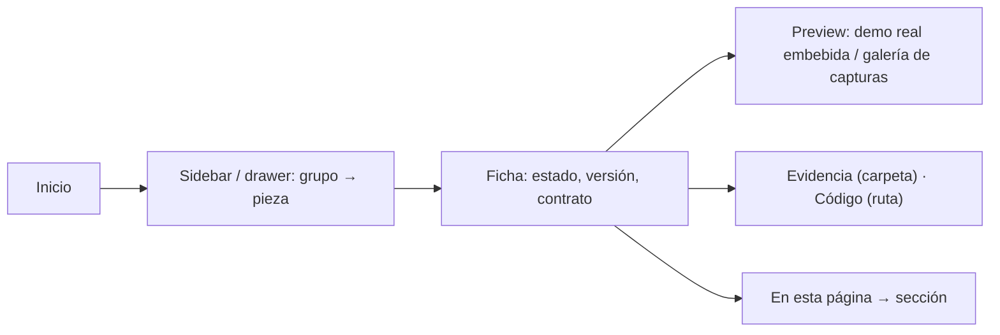

# Brief funcional · DESIGN HUB (shell HTML, inicio, fichas) · r01

**Ruta:** R1 · **Fidelidad:** F2 · **Fecha:** 2026-09-27
**Origen:** encargo documental de mora `design-hub/lab/hub/encargo-mora.md` (esta ronda vuelve a **mora**, no a coco directo, según `documentation-round-standard.md`).
**Fuentes leídas:** el encargo · `.claude/skills/mora-docs/documentation-round-standard.md` (shell, inicio, ficha de pantalla, ficha de componente, metadata, madurez, responsive, fidelidad) · perfil (`hub_layout`, breakpoints, a11y) · `design-hub/README.md` y las 23 fichas Markdown existentes (contenido ya verificado) · `design-hub/system/registry.json` (28 candidate) · `Components/demo/` (demos reales por anchor) · `qa/evidence/*`.

## Enunciado

Quien construye o revisa interfaz en PULZ (dueño, coco, lima, mora o alguien
nuevo) necesita encontrar en un solo sitio qué piezas existen, en qué estado
están, cómo se usan y cómo se ven funcionando, porque hoy ese contenido vive
en 23 archivos Markdown sin navegación ni presentación.

## Pregunta de diseño

¿Se llega desde el inicio a cualquier ficha en ≤2 clics, y cada ficha deja
ver de un vistazo su estado (del registry), su demo real y su evidencia, sin
duplicar contenido ni copiar CSS de los componentes?

- **Verbo principal:** encontrar y leer una ficha (y abrir su demo).
- **Resultado verificable:** desde `index.html`: sidebar → ficha (1 clic);
  ficha → demo real y evidencia (1 clic más); estado y versión visibles en
  el header de cada ficha y en el listado, leídos del registry.
- **Dato dominante:** la ficha; en el inicio, el mapa de piezas por
  madurez.

## Usuarios y permisos

| Usuario | Necesita | Permiso |
|---|---|---|
| Dueño | ver el estado de cada pieza y su evidencia para aprobar/estabilizar | lectura (sitio estático) |
| coco / lima / mora | contrato, API real, demo, QA por faceta | lectura |
| Alguien nuevo | orientarse: qué es el Hub, madurez, dónde está el código | lectura |

## Estructura fijada (estándar de mora + `hub_layout`)

- **Shell**: una sola navegación global. ≥1024: sidebar persistente 260 px
  con grupos **Foundations · Components · Patterns · Screens · QA** (los
  del perfil; `Responsive/{Mobile,Tablet,Desktop}` se retira: el rango vive en
  cada ficha — incógnita 2 del encargo, decidida aquí). <1024: barra superior
  con botón «Menú» que abre un **drawer** con la misma jerarquía (una
  instancia, dos presentaciones; `aria-current`). Breadcrumb en cada ficha.
  Búsqueda: **Could**, no entra en r01.
- **Inicio**: propósito y alcance · cómo se usa (demo, dev server, evidencia)
  · convenciones de madurez (texto + señal no cromática) · mapa de piezas por
  grupo con estado y versión · «lo que NO está hecho». Sin KPIs.
- **Ficha de componente/patrón**: header con metadata (tipo · estado ·
  versión · owner · ronda · actualización) → «En esta página» (derivado de
  los `h2` reales) → Overview → Uso → **Preview = la demo real embebida**
  (`iframe` a `Components/demo/index.html?pieza=<id>&solo=1`) + enlace a
  abrirla → Anatomía → Variantes/estados → Comportamiento → Responsive →
  Accesibilidad → API real → Implementación → QA/Lifecycle (facetas del
  registry). El cuerpo viene del Markdown de mora: el sitio se **genera**
  (`marked`) — una fuente, sin copiar.
- **Ficha de pantalla**: header → Propósito → Ruta/entradas/salidas →
  Componentes usados → Estructura por dispositivo → Estados → Criterios
  verificados → No verificado; Preview = capturas de `qa/evidence/<ronda>/`
  (galería por ancho y tema) porque no hay demo aislada.
- **QA**: página con las rondas de evidencia (enlaces a carpetas y scripts) y
  la matriz de facetas del registry.
- **Madurez**: chip con texto (draft / candidate / stable / deprecated) +
  forma (contorno discontinuo / relleno / relleno con marca / tachado): la
  misma convención que `status-chip` del sistema, sin copiar su CSS (el
  shell tiene su propia clase mínima con los tokens).

## Estados

Ficha con demo · ficha sin demo (pantalla: galería) · pieza `deprecated`
(fuera de la navegación principal, con «Reemplazada por…») · drawer abierto
(compact) · 404 del sitio · sección sin piezas (vacío: «Aún no hay
patrones estables») · texto largo (nombres de archivo y rutas). No hay
carga/offline: sitio estático.

## Flujo anterior / posterior

Antes: nada (Markdown suelto). Después: mora publica sobre el shell
generado; cada nueva ronda añade fichas y el sitio se regenera.

## Riesgo por acción

Solo navegación. Ninguna acción escribe.

## Continuidad

| Situación | Comportamiento |
|---|---|
| Cambio de tamaño | sidebar ↔ drawer sin perder la página ni el anchor |
| Enlace roto | 404 propio del sitio con enlace al inicio |
| Zoom 200 % | sidebar con scroll; contenido a una columna |

## Alcance MoSCoW

- **Must:** shell (sidebar/drawer, breadcrumb, madurez), inicio, ficha de componente con demo embebida, ficha de pantalla con galería, generación desde Markdown + registry, 404.
- **Should:** «En esta página» derivado; página QA; enlaces «código» al repo (ruta de archivo).
- **Could:** búsqueda; modo oscuro manual (sigue al sistema por tokens).
- **Won't:** editar contenido en el sitio; métricas; navegación del producto dentro del Hub.

## Hechos · Supuestos · Incógnitas

**Hechos:** 28 piezas candidate; 23 fichas Markdown con el mismo orden de secciones; demos por anchor `?pieza=<id>&solo=1` ya soportadas por `DemoHub.vue`; evidencia por ronda; tokens en `tokens.css` (claro/oscuro).
**Supuestos:** (1) el sitio se sirve estático desde `design-hub/site/` con el mismo `python3 -m http.server 4321`; (2) `marked` para Markdown → HTML; (3) las secciones «QA/Lifecycle» y «API real» de las fichas siguen siendo Markdown (no se generan del registry salvo el header).
**Incógnitas:** (1) ¿el dueño quiere el Hub publicado (Pages) o solo local? — supuesto: local + repo; (2) búsqueda.

---

# User flow · Encontrar una pieza y ver su demo

| Paso | Intención | Error posible | Recuperación | ¿Se puede volver? |
|---|---|---|---|---|
| Sidebar | elegir pieza | pieza sin ficha | no aparece (solo lo publicado) | sí |
| Ficha | leer contrato y estado | demo no carga (server apagado) | el iframe muestra el enlace directo | sí |
| Anchor | ir a una sección | — | — | sí |
