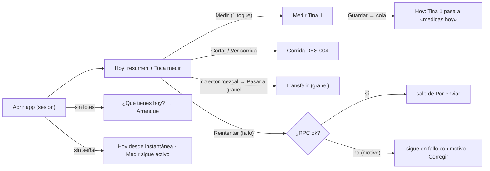

# Brief funcional · INICIO / HOY con datos reales · r01

**Ruta:** R1 · **Fidelidad:** F2 · **Fecha:** 2026-09-28
**Fuentes leídas:** `docs/PULZ_MAESTRO.md` §4.4 (medición diaria), §8.3 (cola), §11.1, §13.1–13.2 #3, §16 · `docs/plan/FASE-5.md` (ronda 5, DUDAS #13) · `apps/web/src/modules/inicio/{api.ts,pages/InicioEmpresaPage.vue}` (placeholder con tres tarjetas «Fase 5» y «¿Qué tienes hoy?» → arranque) · `modules/fermentacion/api.ts` (`UsoTina`, `diaDelCiclo`, `tocaMedirHoy`, `agrupar`), `components/FilaUso.vue` · `modules/destilacion/api.ts` (`Corrida`, `ColectorConSaldo`, `cargarDestilacion`) · `shared/offline/{cola,useCola}.ts` (`ElementoCola.resumen/estado/error/requiereNota`, `reintentar`, `corregir`) · `app/AppShell.vue` (banner «N capturas pendientes · f fallaron» + Reintentar global) · `0002_plataforma.sql` (`measurement_reminder_hour` 0–23 default 9; `fermentation_expected_days` default 7) · `0026` (`tinas_en_uso`, `corridas`, `colectores_con_saldo`) · rondas shell/r01 (Inicio como destino), fermentacion/r01, destilacion/r01 (instantánea con fecha).

## Enunciado

Cualquier persona del palenque (operador, productor o admin) necesita **ver
al abrir la app qué le toca hoy —qué tinas medir, qué corridas siguen
abiertas, qué colectores tienen líquido y qué capturas no han llegado— y
llegar a medir en un toque**, porque a las 9 de la mañana, con el teléfono
en una mano, hoy Inicio solo dice «Fase 5» y la tarea diaria obliga a
recorrer Fermentación tina por tina.

## Pregunta de diseño

¿Alguien que abre la app a las 9 de la mañana con el teléfono en una mano
sabe en 3 segundos qué le toca hoy y llega a medir en ≤2 toques?

- **Verbo principal:** ver qué toca hoy (Inicio no captura nada; es lectura
  + atajos). Verbo derivado: ir a medir.
- **Resultado verificable:** la lista «Toca medir» coincide con
  `agrupar(tinas_en_uso).porMedir`; «Medir» abre `/fermentacion/:ciclo/medir`
  de esa tina; tras medir, la tina sale de «Toca medir» y entra en «medidas
  hoy»; «Reintentar» de una captura fallida vuelve a llamar a la RPC.
- **Dato dominante:** cuántas tinas toca medir y cuáles, con **día N de M**
  y **desde cuándo no se mide**. Secundario: corridas abiertas y colectores
  con contenido; capturas por enviar.

## Usuarios y permisos (RLS/`rpc_guard` reales)

| Usuario | Ve | Atajos que puede usar |
|---|---|---|
| Operador | todo lo de Hoy | Medir (cola), Cortar (cola), Reintentar/Corregir lo suyo |
| Productor / Admin | igual | además «Abrir corrida», «Llenar tinas», «Pasar a granel» (con señal) |
| Modo lectura (vencida) | igual | ninguno de captura; solo consulta |

Maguey y Horneado no aparecen en Hoy: no tienen «tarea diaria» (§13.2 #3
solo nombra tinas, corridas, colectores y capturas pendientes).

## Estructura (una vista dentro del shell, destino Inicio)

`/e/:slug/inicio` — **Hoy**. Cabecera de página «Hoy · lunes 28 de
septiembre». Línea resumen (`role=status`): «3 tinas por medir · 1 corrida
abierta · 2 capturas por enviar». Tres bloques en orden de urgencia:

1. **Toca medir** (h2) — filas de `porMedir` ordenadas como en
   Fermentación (más días sin medir primero): **tina** · día N de M
   (`diaDelCiclo`, `fermentation_expected_days`) · última medición «ayer
   9:10 · Tomás» o «sin mediciones» · litros · estado (chip) · **Medir**.
   Antes de la hora del recordatorio la fila lleva «toca desde las 9:00»;
   después, «toca medir» (la hora solo ordena y rotula; sin push, DUDAS #13).
   Debajo, una línea: «2 tinas ya medidas hoy · 1 lista para destilar →
   Fermentación». Con ≥8 por medir: se muestran 8 y «y 4 más → Fermentación».
   Vacío: «Todo medido por hoy» (state-block) con enlace a Fermentación.
   Sin tinas en uso: «Sin tinas fermentando» → «Llenar tinas» (admin/productor).
2. **Destilación** (h2) — **corridas abiertas**: folio · alambique · pasada ·
   L cargados / L cortados · **Cortar** (operador+) y «Ver corrida»;
   **colectores con contenido**: colector · clase · litros · % Alc. → «Pasar
   a granel» solo para mezcal (admin/productor) / «Ver». Vacío: «Sin corridas
   abiertas» + «Abrir corrida» (admin/productor; el operador solo lee).
3. **Por enviar** (h2, solo si hay elementos) — cada `ElementoCola`:
   `resumen` («Medición · Tina 1 · día 3») · chip pendiente / fallo · motivo
   del fallo (`error`) · **Reintentar** (fallo) y **Corregir** (si
   `requiereNota`, abre la pantalla de origen). Las pendientes dicen
   «esperan señal»; en línea se envían solas (useCola). El banner del shell
   sigue siendo el total; Inicio es el detalle.

Con lotes pero nada en ningún bloque: «Hoy no hay nada pendiente» + atajos
de consulta. Sin lotes: «¿Qué tienes hoy?» → arranque (se conserva).

## Estados

Carga (esqueleto de tres bloques) · sin lotes → arranque · **default**
(3 por medir, 1 corrida, 1 colector, 2 en cola) · antes de la hora del
recordatorio · todo medido · sin tinas · sin corridas ni colectores · nada
pendiente · muchas tinas (14 por medir) · folios/nombres largos · **sin
señal** («Mostrando datos guardados el …»; Medir y Cortar siguen activos
porque van por la cola; lo demás deshabilitado) · solo lectura · operador ·
cola con fallo (motivo) y con corrección pendiente · error de carga.

## Riesgo por acción

Ninguna acción de Inicio escribe: Medir/Cortar/Abrir corrida navegan a su
pantalla; **Reintentar** reenvía una captura ya hecha con la misma clave
(idempotente, sin confirmación); **Corregir** abre la pantalla de origen.

## Continuidad

- **Sin señal:** instantánea con fecha (`conInstantanea(org,"inicio-hoy")`);
  «Medir»/«Cortar» activos (cola); al volver la señal recarga.
- **Sesión reanudada / empresa cambiada:** recarga y cambia la cola
  (`usarEmpresa`), como el shell.
- **Hora:** «hoy» y «día N» los decide el navegador (zona del palenque).
- **Cambio de tamaño:** una sola fuente de datos; en compact la primaria
  baja a la barra («Medir Tina 1»); sin ramas duplicadas.

## Alcance MoSCoW

- **Must:** los tres bloques con datos reales; Medir en un toque; día N de
  M; hora del recordatorio como rótulo/orden; Reintentar fallidas;
  instantánea; permisos por rol; arranque cuando no hay lotes.
- **Should:** «medidas hoy» y «listas» como línea de contexto; Corregir
  desde Inicio; «y N más».
- **Could:** filtro por tina; ocultar bloques vacíos por preferencia.
- **Won't:** notificaciones push (DUDAS #13); Maguey/Horneado en Hoy; capturar
  desde Inicio; resumen de granel (Fase 6 / Trazabilidad).

## Hechos · Supuestos · Incógnitas

**Hechos:** `tinas_en_uso` trae `status`, `started_at`, `ultima_medicion_at`,
`litros`, `mediciones`; `tocaMedirHoy` = fermentando sin medición con fecha
local de hoy; `corridas` trae `status`, `alambique`, `pass`,
`litros_cargados/cortados`; `colectores_con_saldo` trae clase, litros, abv;
la cola expone `resumen`, `estado`, `error`, `requiereNota`, `reintentar`;
`measurement_reminder_hour` y `fermentation_expected_days` están en
`organization_settings` (lectura por RLS).
**Supuestos (declarados):** (1) «toca desde las H:00» solo cambia el rótulo,
no saca la tina de la lista; (2) «Por enviar» se oculta cuando la cola está
vacía (el banner del shell ya cubre el total); (3) Maguey/Horneado fuera de
Hoy; (4) 8 filas máximo por bloque antes de «y N más».
**Incógnitas:** (1) si el dueño quiere en Hoy el saldo de granel (queda
para Trazabilidad); (2) si «Corregir» desde Inicio debe abrir la pantalla
con la captura precargada (depende de cómo lo resolvió fermentación/r01: hoy
la corrección se hace en la fila de la tina).

## Flujos

