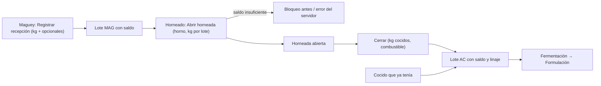

# Brief funcional · MAGUEY y HORNEADO: recepción y horneadas · r01

**Ruta:** R1 · **Fidelidad:** F2 · **Fecha:** 2026-09-27
**Fuentes leídas:** `docs/PULZ_MAESTRO.md` §2 (principio 1: cualquier etapa puede ser la primera), §4.1–4.2, §11.1, §12.1, §13.1, §16 Fase 5 · `0015` (`registrar_recepcion_maguey(kg, especie?, predio?, proveedor?, piñas?, nota?, folio?)` → lote `maguey` con historia **completa**; `registrar_entrada('agave_cocido', null, kg, …)` → lote `AC` sin historia (o compra: declarada); admin y productor) · `0016` (`abrir_horneado(horno, lotes[], kilos[])`: solo lotes de maguey, `SALDO_INSUFICIENTE` contra `solid_remaining`; `cerrar_horneado(horneada, kg cocidos, combustible?, folio?)` → lote `AC` con linaje a cada maguey; admin y productor) · `0011` (`solid_lot_balances`: `remaining_kg` de maguey y cocido) · `roasting_runs` (status, started_at, ended_at, cooked_kg, fuel_note, output_lot_id) · `maguey_receptions` (especie, predio, proveedor, piñas, kg, nota) · catálogos `species`, `predios`, `suppliers` (Configuración) · piezas de las rondas anteriores (`origin-allocation` en kg, `datetime-field`, `task-layer`, `list-stack`).

## Enunciado

El productor necesita **registrar el maguey que llega (kilos, de dónde, de
quién) y cada horneada (qué lotes entran, cuántos kilos cocidos salen)**,
porque ahí empieza la historia de cada mezcal: sin recepción no hay
trazabilidad «completa», y sin horneada no hay agave cocido que formular.

## Pregunta de diseño

¿Puede el productor registrar una recepción en menos de un minuto con solo
los kilos (lo demás opcional), abrir una horneada eligiendo qué maguey y
cuántos kilos sin pasarse del saldo, y cerrarla con los kilos cocidos de
forma que el cocido quede listo para la formulación?

- **Verbos principales:** registrar recepción (Maguey); abrir y cerrar
  horneada (Horneado).
- **Resultado verificable:** lote `MAG-…` con saldo en kg; horneada abierta
  con sus lotes; al cerrar, lote `AC-…` con kilos y linaje; Fermentación →
  Formulación lo ve como «agave cocido con saldo».
- **Dato dominante:** en Maguey, **kilos restantes** por lote; en Horneado,
  **horneadas abiertas** y **cocido con saldo**.

## Usuarios y permisos (rpc_guard real)

| Usuario | Puede | No puede |
|---|---|---|
| Admin / Productor | recepción, entrada directa de cocido, abrir y cerrar horneada | — |
| Operador | ver lotes y horneadas | registrar (§18 #4: el supuesto vigente es que no); los botones no se muestran |

## Estructura

Dos destinos del shell, una ronda (misma estructura: lista + formulario o capa):

**Maguey**
1. `/e/:slug/maguey` — Lotes de maguey con saldo (`solid_lot_balances` +
   `maguey_receptions`): folio, especie, predio o proveedor, kg recibidos y
   **kg restantes**, piñas, cuándo y quién; «Agotados» (últimos, plegados).
   Primaria: **Registrar recepción** (FAB en compact).
2. `/e/:slug/maguey/recepcion` — página: **kilos** (obligatorio), especie
   (catálogo), piñas (opcional), predio (catálogo), proveedor (catálogo),
   nota de calidad, folio opcional, ¿cuándo pasó? → «Registrar 2,000 kg de
   Espadín». Si no hay especies/predios: se puede registrar solo con kilos
   y un enlace a Catálogos.

**Horneado**
3. `/e/:slug/horneado` — «Horneadas abiertas» (folio, horno, inicio, quién,
   kg cargados por lote; acción **Cerrar horneada**) · «Agave cocido con
   saldo» (lotes `AC`: kg restantes, de qué horneada, cuándo; enlace «Llenar
   tinas» → Fermentación/formular) · «Últimas horneadas» (cerradas: inicio →
   fin, kg cargados → kg cocidos, combustible). Primaria: **Abrir horneada**
   (FAB). Secundaria: «Cocido que ya tenía» (capa).
4. `/e/:slug/horneado/abrir` — página: horno (select), **maguey con kilos**
   (`origin-allocation` en kg: lotes con saldo, error por encima del saldo),
   folio opcional, ¿cuándo empezó? → «Abrir horneada con 6,200 kg».
5. **Cerrar horneada** — capa (`task-layer`): kg cocidos (obligatorio),
   combustible (texto), folio del cocido opcional, ¿cuándo terminó?, nota →
   «Cerrar con 5,900 kg cocidos». Muestra los kg cargados como referencia
   (merma visible como diferencia, no se guarda).
6. **Cocido que ya tenía** — capa: kilos, ¿cuándo?, nota → entrada directa
   `agave_cocido` (carga inicial, sin historia).

Todo requiere señal (§8.3: no son mediciones ni cortes). Sin señal: lectura
desde la instantánea y botones deshabilitados con motivo.

## Estados

Maguey: carga · sin lotes (primaria Registrar recepción) · default · agotados
· sin conexión · solo lectura · operador · contenido largo · recepción
(formulario) · recepción sin catálogos (solo kilos + enlace) · error del
servidor · registrada (vuelve a la lista con aviso). Horneado: carga · sin
hornos (→ Recursos) · sin horneadas ni cocido (primaria Abrir horneada +
«Cocido que ya tenía») · default · sin conexión · operador · abrir (kg por
lote, saldo insuficiente bloquea antes) · sin maguey con saldo (bloquea con
enlace a Maguey) · cerrar (capa) · cocido que ya tenía (capa) · cerrada
(vuelve con aviso y el lote `AC` listo).

## Flujo anterior / posterior

Antes: Configuración (especies, predios, proveedores, hornos). Después:
Fermentación → Formulación toma el cocido con saldo; Trazabilidad (Fase 6)
llega al maguey y su predio.

## Riesgo por acción

| Acción | Tipo | Confirmación |
|---|---|---|
| Registrar recepción | crea lote (se corrige con `corregir_operacion`, Fase 6) | el botón dice kilos y especie |
| Abrir horneada | consume saldo de maguey (irreversible) | el botón dice kilos y horno; resumen en la página |
| Cerrar horneada | **irreversible** (nace el cocido; no se reabre) | capa con kg cargados vs. cocidos; el botón dice los kilos |
| Cocido que ya tenía | crea lote sin historia | el botón dice los kilos |

## Continuidad

| Situación | Comportamiento |
|---|---|
| Sin conexión | lectura desde la instantánea; primarias deshabilitadas con motivo |
| Error de saldo | mensaje con causa; datos conservados |
| Sesión reanudada | nada en cola |
| Cambio de tamaño | filas apiladas <1024; formularios en una columna con parejas en ≥600; capas = hoja en compact |

## Alcance MoSCoW

- **Must:** lista de maguey con saldo; recepción con solo kilos obligatorios; horneadas abiertas/cocido/últimas; abrir con kg por lote; cerrar con kg cocidos y combustible; cocido que ya tenía.
- **Should:** agotados plegados; enlace «Llenar tinas» desde el cocido.
- **Could:** rendimiento (cocido / cargado) como texto; foto de la recepción.
- **Won't:** compra de maguey con certificado (no existe en el esquema: la recepción ya lleva proveedor); editar una recepción (Fase 6).

## Hechos · Supuestos · Incógnitas

**Hechos:** kg obligatorio y lo demás opcional en la recepción; horneada solo con lotes de maguey y saldo suficiente; el cocido nace al cerrar con linaje; entrada directa de cocido con `registrar_entrada('agave_cocido', null, kg)`; admin y productor; `solid_lot_balances` da el saldo en kg.
**Supuestos:** (1) el operador no registra maguey (§18 #4, supuesto de la tabla); (2) «Agotados» = `remaining_kg = 0`, últimos 10; (3) la merma de la horneada se ve como diferencia y no se guarda (igual que las vinazas, DUDAS #15).
**Incógnitas:** (1) ¿registran el corte de maguey (fecha de jima) además de la llegada? (no hay campo); (2) ¿varios hornos a la vez con el mismo lote? (sí: saldo por lote, no por horno).

---

# User flow · Recibir y hornear

**Entrada:** llega maguey → Maguey → Registrar recepción · **Endpoint observable:** el cocido aparece en Fermentación → Formulación con saldo.

| Paso | Intención | Error posible | Recuperación | ¿Se puede volver? |
|---|---|---|---|---|
| Recepción | anotar lo que llegó | sin kilos | bloqueo con texto | sí |
| Abrir | decir qué entra al horno | kg > saldo | error en la fila antes de enviar | sí |
| Cerrar | decir cuánto salió | horneada ya cerrada | mensaje | no (irreversible) |
