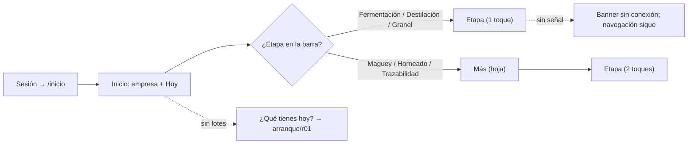
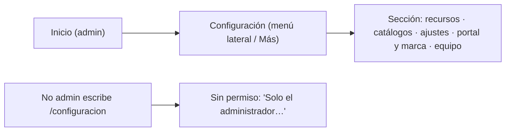
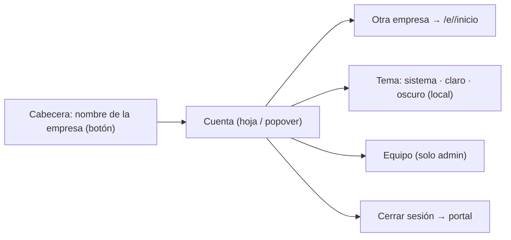

# Brief funcional · SHELL de la app (navegación, cuenta, tema) · r01

**Ruta:** R1 · **Fidelidad:** F2 · **Fecha:** 2026-09-27
**Fuentes leídas:** `docs/PULZ_MAESTRO.md` §8.3, §11.1, §13.1–§13.4, §16 (Fase 4) · `docs/plan/FASE-4.md` · `CLAUDE.md` §3 · perfil `.claude/skills/lima/profiles/pulz.md` (breakpoints, a11y, sprite, `coco.data_contract`) · `design-hub/system/registry.json` (14 piezas candidate) · código real: `apps/web/src/app/router.ts`, `modules/acceso/store.ts` (`membresiaActual`, `esAdmin`, `modoLectura`, `membresias`, `cerrarSesion`), `modules/inicio/pages/InicioEmpresaPage.vue` (placeholder), `shared/ui/Aviso.vue`, `shared/ui/iconos.svg` (12 símbolos) · `design-hub/lab/acceso/r01/` (matriz: menú lateral 200/240, sin menú en acceso).

## Enunciado

Cualquier persona del palenque (admin, productor u operador) necesita llegar
a la etapa que le toca hoy y saber siempre en qué empresa y con qué permisos
está, porque trabaja con una mano, con sol de frente y a veces con más de una
empresa, y hoy la app solo tiene un placeholder con "Equipo" y "Cerrar sesión".

## Pregunta de diseño

¿Cualquier persona, con una mano y sol de frente, llega a la etapa que le toca
en ≤2 toques y sabe siempre en qué empresa y con qué permisos está?

- **Verbo principal:** ir a una etapa del proceso (y volver a Inicio).
- **Resultado verificable:** desde Inicio, cada destino de §13.1 está a 1 toque
  (los cuatro más frecuentes en compact) o a 2 (los demás, vía "Más"); la
  empresa actual se lee sin abrir nada; Configuración solo aparece al admin.
- **Dato/acción dominante:** el destino de proceso. En Inicio, el bloque
  "¿Qué tienes hoy?" cuando la empresa no tiene lotes.

## Usuarios y permisos

| Usuario | Necesita | Permiso (RLS real, §11.1) |
|---|---|---|
| Operador | Fermentación (medir), Destilación (cortes), Inicio | lee todo; no ve Configuración |
| Productor | además Maguey, Horneado, Granel, Trazabilidad | no ve Configuración |
| Admin / titular | todo + Configuración (recursos, catálogos, ajustes, portal y marca, equipo) | admin |
| Persona con varias empresas | cambiar de empresa desde su cuenta | según `mis_membresias` |
| Empresa vencida | ver y exportar, no registrar | `read_only` → banner y sin acciones de escritura |

## Estructura fijada (§13.1)

Menú que sigue al proceso: **Inicio · Maguey · Horneado · Fermentación ·
Destilación · Granel · Trazabilidad · Configuración (solo admin)**. Ocho
destinos no caben en una navegación inferior con targets de 44 px: en compact
van **cuatro fijos + "Más"**. Los cuatro fijos salen de la frecuencia de uso
diaria del brief de §13.2 (medir tinas, corridas, granel, inicio):
**Inicio · Fermentación · Destilación · Granel**; "Más" abre una hoja con
Maguey · Horneado · Trazabilidad · Configuración (admin). Supuesto declarado
(incógnita 2): el orden de frecuencia se confirma con el dueño.

La **cuenta** (empresa actual, cambiar de empresa, tema, Equipo si admin,
Cerrar sesión) vive detrás del nombre de la empresa en la cabecera (compact y
medium) o al pie del menú lateral (expanded). No es un destino del proceso.

## Estados

Carga (esqueleto de Inicio) · vacío (sin lotes → "¿Qué tienes hoy?") · destino
"próximamente" (Fase 5) · sin permiso (Configuración por URL sin ser admin) ·
sin conexión (banner; el contador de capturas en cola es Fase 5, solo el hueco)
· solo lectura · nombre de empresa largo · varias empresas · teclado virtual
sobre la navegación inferior · zoom 200 % · movimiento reducido · tema
claro/oscuro/sistema.

## Flujo anterior / posterior

Antes: acceso (`/e/:slug` → sesión → `/inicio`); las pantallas de acceso no
llevan shell. Después: cada destino de proceso (Fase 5), Configuración y
primer arranque (rondas `configuracion/r01` y `arranque/r01`).

## Riesgo por acción

| Acción | Tipo | Confirmación |
|---|---|---|
| Ir a un destino | navegación reversible | ninguna |
| Cambiar de empresa | reversible (vuelve a Inicio de la otra) | ninguna; se muestra a cuál se fue |
| Cambiar tema | reversible, local | ninguna |
| Cerrar sesión | reversible (vuelve a entrar) | ninguna (ya decidido en acceso/r01) |

## Continuidad

| Situación | Comportamiento |
|---|---|
| Conexión lenta | shell inmediato; Inicio con esqueleto de la misma huella |
| Sin conexión | banner arriba; navegación disponible (las pantallas deciden qué se puede hacer); hueco para "N capturas por enviar" (Fase 5) |
| Error al cargar membresías | bloque de error con Reintentar en el cuerpo; el shell no desaparece |
| Sesión reanudada | vuelve al último destino (ruta); si `must_change_password`, el guardia manda al cambio |
| Cambio de tamaño | misma instancia: el menú lateral pasa a inferior + "Más" sin perder la ruta ni el foco en el contenido |

## Alcance MoSCoW

- **Must:** navegación por proceso en los tres espacios; cabecera con empresa; cuenta con cambiar de empresa, tema y cerrar sesión; Configuración solo admin; banners; destinos vacíos "próximamente"; Inicio con "¿Qué tienes hoy?" cuando no hay lotes; hueco de FAB por destino.
- **Should:** tema persistido por navegador; "N por enviar" en el banner sin conexión (hueco); acceso directo a Equipo desde la cuenta (admin).
- **Could:** atajos de teclado en expanded (1–8); búsqueda global.
- **Won't (esta ronda):** contenido real de Inicio/hoy y de las etapas (Fase 5); menú del Hub; notificaciones (§13.2 #3 "capturas pendientes" es Fase 5).

## Hechos · Supuestos · Incógnitas

**Hechos:** rutas y guardias actuales; `mis_membresias` trae `name`, `brand_color`, `role`, `read_only`, `cancelled` por empresa; `Aviso` ya existe; el sprite trae `i-home`, `i-maguey`, `i-horno`, `i-tina`, `i-destila`, `i-lote`, `i-medir`, `i-mas` (+), `i-bell`, `i-clock`, `pulz-mark`; no hay icono de Configuración, Trazabilidad, Granel/tanque ni "Más".
**Supuestos (declarados):** (1) los cuatro destinos fijos de compact; (2) Granel usa `i-lote` provisionalmente y Configuración/Trazabilidad/Más van con texto hasta que el sprite tenga símbolo (traspaso a lima → dueño); (3) con el teclado virtual abierto la navegación inferior se oculta (técnica `visualViewport`), porque tapar el campo enfocado es peor que perder el menú un momento.
**Incógnitas:** (1) ¿el titular con dos empresas cambia de empresa a menudo? (decide si "cambiar de empresa" merece estar en la cabecera o basta en la cuenta); (2) orden de frecuencia real de las etapas; (3) si el dueño quiere símbolos nuevos en el sprite (4: tanque, trazabilidad, ajustes, más).

---

# User flow 1 · Entrar → Inicio → etapa (operador, compact)

**Entrada:** sesión válida en `/e/<slug>/inicio` · **Endpoint observable:** la pantalla de la etapa (por ahora "próximamente") con la ruta visible.

| Paso | Intención | Error posible | Recuperación | ¿Se puede volver? |
|---|---|---|---|---|
| Inicio | saber qué toca hoy y dónde estoy | membresías no cargan | bloque de error + Reintentar | — |
| Barra inferior | ir a la etapa frecuente | — | — | sí (Inicio siempre en la barra) |
| Más | ir a etapa menos frecuente | cerrar sin elegir | Esc/atrás/scrim cierra, foco vuelve a "Más" | sí |
| Etapa | trabajar (Fase 5) | "próximamente" | volver a Inicio | sí |

# User flow 2 · Admin → Configuración

# User flow 3 · Cuenta: cambiar de empresa · tema · cerrar sesión

| Paso | Intención | Error posible | Recuperación | ¿Se puede volver? |
|---|---|---|---|---|
| Cuenta | ver quién soy y dónde | — | — | Esc/atrás |
| Cambiar de empresa | trabajar en otra | la otra está cancelada/vencida | no aparece (cancelada) / aparece con "solo lectura" | sí, desde la cuenta de la otra |
| Tema | ver bajo el sol o de noche | almacenamiento bloqueado | aplica solo en la sesión | sí |
